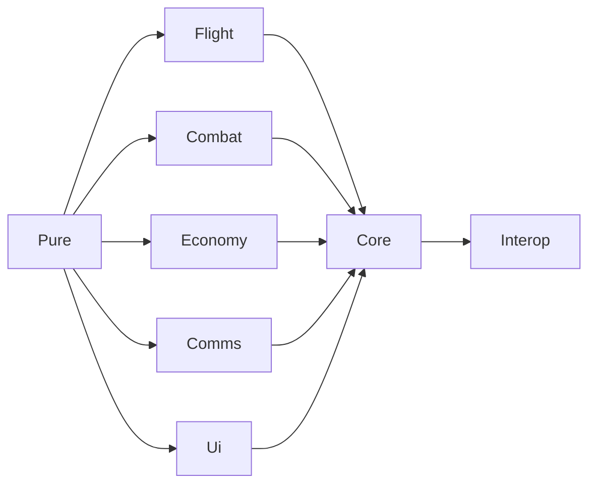

# Architecture

A folder-by-folder map of the codebase, for anyone (human or agent) making structural
changes. For gameplay/feature documentation, see [README.md](README.md).

## Folder responsibilities

| Folder | Owns |
|---|---|
| `Core/` | Plugin entry point, the per-frame driver (`WingCommandManager`), the roster (`WingRegistry`), config, pilots, recruitment/recovery/takeover, kill credit. |
| `Flight/` | Autopilot states (one file per behaviour: `AttackRunState`, `OrbitState`, ...) and formation flight/collision math that needs live `Aircraft`/`Unit` state. |
| `Combat/` | Wingman weapons, ROE, tactical spread/deconfliction, countermeasures, radar jamming. |
| `Economy/` | Squadron shop, loadout editor/templates, delivery and launch-lane sequencing, supply reserve. |
| `Comms/` | Radio chatter routing, subtitles, audio playback. |
| `Ui/` | HUD, MFD panels (`VanillaMfdRebuild.*`), WMC screen (`WmcScreen.*`), radial menu, map overlays. |
| `Pure/` | Engine-free logic: formation math, chatter/codec text generation, AI arbitration, tuning constants. No `UnityEngine`/Assembly-CSharp references — this is what makes it unit-testable. |
| `Interop/` | The public, reflection-safe API surface other mods (e.g. Boscali Summer) read. Everything else in the mod is `internal`. |

## Dependency direction



`Pure/` depends on nothing else in the mod (only `System.*`) and everything else may depend
on it. `Core/` is the hub: `WingCommandManager` ticks every other folder's subsystems once
per frame. Nothing should depend "upward" into `Pure/` gaining an engine reference — that's
the one rule enforced by [tests/WingCommand.PureTests](tests/WingCommand.PureTests), which
links `Pure/*.cs` into a plain `net8.0` xunit project with no Unity/BepInEx references. If
that project fails to compile, something in `Pure/` picked up an engine dependency.

## Partial-class-per-concern convention

Large classes that cover more than one concern are split across multiple files sharing a
`partial` class declaration, named `TypeName.Concern.cs`, rather than left as one large file
or refactored into unrelated types. This keeps each file's diff local to one concern while
the state and lifecycle stay on a single class. Examples:

- [Ui/WmcScreen.cs](Ui/WmcScreen.cs) + `.Tactical.cs` / `.Supply.cs` / `.Loadout.cs` / `.Wing.cs` — one file per WMC tab.
- [Core/WingCommandManager.cs](Core/WingCommandManager.cs) + `.Radial.cs` / `.Recruit.cs` / `.Orders.cs` / `.Selection.cs` — the per-frame driver split by input/queue/dispatch/selection.
- [Ui/VanillaMfdRebuild.cs](Ui/VanillaMfdRebuild.cs) + `.Map.cs` / `.Hud.cs` / `.Faction.cs` / `.Target.cs` / `.Mission.cs` / `.PagingGrid.cs` — one file per vanilla MFD screen presenter, plus the shared paging widget.

When adding a new concern to one of these types, add a new `TypeName.Concern.cs` file
rather than growing an existing one past a page or two of unrelated methods.

## Tests

[tests/WingCommand.PureTests](tests/WingCommand.PureTests) is a standalone xunit project
that links `Pure/*.cs` directly (not a `ProjectReference` to `WingCommand.csproj`, which
requires the game's Managed assemblies on disk to build). Run it with:

```powershell
dotnet test tests/WingCommand.PureTests
```

`WingCommand.csproj` excludes `tests/**/*.cs` from its own compile glob
(`EnableDefaultCompileItems` would otherwise pick the test project's sources up too).
