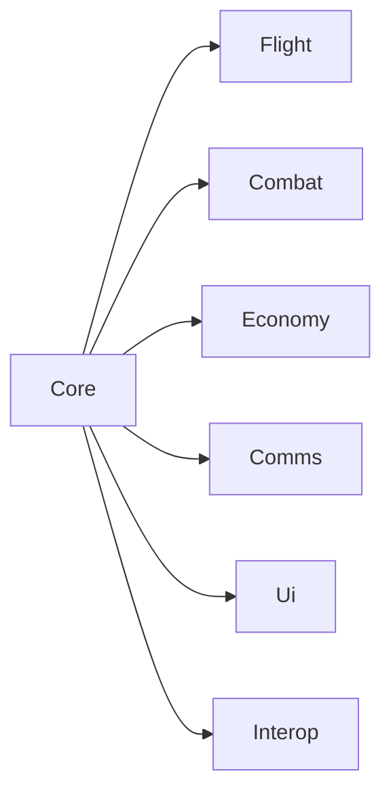
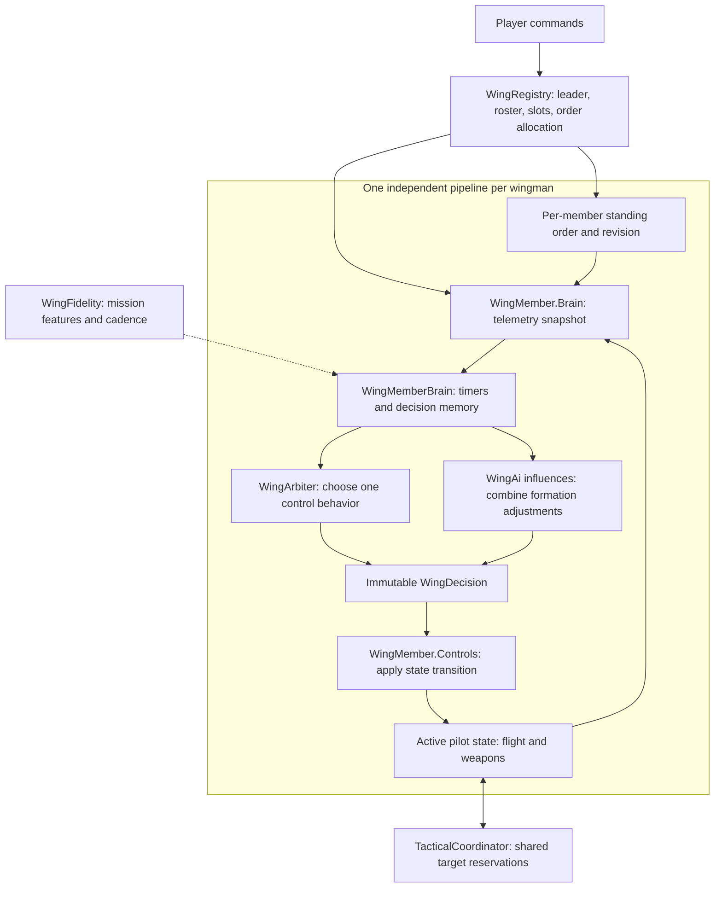

# Architecture

A folder-by-folder map of the codebase, for anyone (human or agent) making structural
changes. For gameplay/feature documentation, see [README.md](README.md).

## Folder responsibilities

| Folder | Owns |
|---|---|
| `Core/` | Plugin entry point, the per-frame driver (`WingCommandManager`), the roster (`WingRegistry`), config, pilots, recruitment/recovery/takeover, kill credit. |
| `Flight/` | Autopilot states (one file per behaviour: `AttackRunState`, `OrbitState`, ...) and formation flight/collision math that needs live `Aircraft`/`Unit` state. |
| `Combat/` | Wingman weapons, ROE, tactical spread/deconfliction, countermeasures, radar jamming. |
| `Economy/` | Squadron shop, loadout editor/templates, delivery and launch-lane sequencing, supply reserve. |
| `Comms/` | Radio chatter routing, subtitles, audio playback. |
| `Ui/` | Wing HUD, WMC screen (`WmcScreen.*`), radial menu, wing map overlays. |
| `Assets/` | Embedded PNG icons and JSON aerobatic phases; editing instructions in `Assets/README.md`. |
| `Pure/` | Engine-free logic: formation math, chatter/codec text generation, AI arbitration, tuning constants. No `UnityEngine`/Assembly-CSharp references — this is what makes it unit-testable. |
| `Interop/` | Presence and map integration other mods (e.g. Boscali Summer) read. Additional public extension contracts live in `Pure/` and `Core/WingBehaviourCatalog.cs`. |

## Runtime coordination



The arrows show coordination, not enforced assembly boundaries: subsystems also read Core
state. `Pure/` depends on nothing else in the mod (only `System.*`) and everything else may depend
on it. `Core/` is the hub: `WingCommandManager` ticks every other folder's subsystems once
per frame. Nothing should depend "upward" into `Pure/` gaining an engine reference — that's
the one rule enforced by [tests/WingCommand.PureTests](tests/WingCommand.PureTests), which
links `Pure/*.cs` into a plain `net8.0` xunit project with no Unity/BepInEx references. If
that project fails to compile, something in `Pure/` picked up an engine dependency.

Pure policies are grouped by responsibility: `WingOrders.cs` owns order/ROE semantics,
`FlightPolicies.cs` owns flight transitions, `EconomyPolicies.cs` owns purchase rollback,
capacity and launch rules, and `SelectionPolicies.cs` owns roster selection rules.
Keep new policies with their owning concern rather than adding a general-purpose utility file.
`Flight/WingPilotState.cs` owns the shared setup for all live flight states.

## Orders, arbitration and flight influences

`WingMember` owns a revisioned `StandingOrder<WingDirective>`. Player dispatch writes the
order; each aircraft's `WingMemberBrain` evaluates it from telemetry. Defensive breaks,
leash recall and idle-combat regrouping preserve that order and its payload. A completed
one-shot task or enabled automatic return may explicitly replace it.

The decision path has explicit responsibilities. `Pure/WingFidelity.cs` holds mission-wide
Smart/Performance settings; it has no per-aircraft behavior state.



| Part | Responsibility | State lifetime |
|---|---|---|
| `WingRegistry`, formation settings, `TacticalCoordinator` | Coordinate leader/slots, allocate orders, share spacing and expiring target reservations. | Shared wing context and reservations. |
| `WingFidelity` | Select feature gates and update cadence for Smart/Performance. | One mission setting snapshot. |
| `StandingOrder<WingDirective>` | Retain player intent, target/point payload and revision. | One per wingman. |
| `WingMemberBrain` | Schedule decisions, remember warning/hold timing, evaluate and commit. | Independent memory per wingman. |
| `WingArbiter`, reflexes | Select one control behavior by priority band, score and valid minimum holds. | Stateless scoring against the snapshot. |
| `IWingInfluence` providers | Combine capture, damping, spacing and bank adjustments within bounds. | Stateless providers; resulting profile per member. |
| Aircraft adapter and active pilot state | Bind the selected controller, retain its flight filters/phases, and execute against Unity/native aircraft. | Controller instances per wingman. |

Wing-wide coordination currently covers roster/leader/slot management, explicit attack
allocation and target reservations. It does not contain a separate strategic mission planner.
The components remain in one plugin assembly; the Pure decision layer is engine-free,
while the adapter and flight controllers intentionally use native game state.

`Pure/WingMemberBrain.cs` owns per-aircraft warning/hold clocks, evaluation cadence and the
committed decision. `Evaluate` has no lifecycle side effects; the engine adapter can retire
an obsolete one-shot task, resample, and commit only the resulting decision. Losing the
active wing controller bypasses the normal cadence, as do warnings and pending completion.
Profiles and decision urgency refresh without restarting a controller; task revisions trigger a handoff only
when the standing task owns flight. Each member has independent decision memory even
though the registry of stateless reflexes and influences is shared.

`Core/WingMember.Brain.cs` samples Unity/game state and coordinates that pipeline.
`Core/WingMember.Controls.cs` owns behavior-to-state mapping and pilot transitions;
`Core/WingMember.cs` keeps roster lifecycle, order payloads and completion ownership. Flight
controllers fly through the selected pilot state. The profile's capture/damping/bank
adjustments currently feed fixed-wing formation, and its spacing feeds formation geometry.
Native combat/landing and most special-task controllers retain their own control laws.
A registered behavior that is already active counts as successfully applied, so an
idempotent state switch cannot accidentally fall back to a different controller.
A missing or failed behavior temporarily suppresses its requesting reflex and records the
actual Task fallback, so later orders cannot be trapped behind an unavailable extension.
Registering a replacement factory revives availability-blocked reflexes; it does not clear
genuine scoring or metadata faults. A factory that installs a successor before failing
leaves that successor available for the next attempt. Factory registrations persist across
missions; cached pilot-state instances live only on the member.
Factory replacement creates a new registration identity: existing members rebuild only
that cached state and apply it on the next evaluation. Observed removal is remembered so
late re-registration wakes the adapter without polling a missing controller repeatedly.

`IWingReflex` is for decisions that require one control owner. Survival, Safety, Cohesion
and Task are strict priority bands; scores compete only within a band and ties use stable
namespaced IDs. Optional `IWingReflexLifecycle` supplies a hold-validity predicate and an
emergency flag. Holds bridge noisy scores, but cannot retain a leash recall after a new
route or RTB makes it inapplicable. A same-band emergency can interrupt a minimum hold.
Metadata, score and lifecycle callback faults disable only the failing provider; diagnostics
cannot throw back into decision making. Metadata is sampled consistently for each pass,
and faults are reported once until replacement or mission reset.

Use `IWingInfluence` for continuous flight adjustments. Every eligible influence evaluates
the same immutable `WingFlightSituation`; `WingAi.BlendFlight` combines weighted deltas
once, then clamps capture, spacing and damping. Bank reductions compose by minimum, so
another contribution cannot cancel a safety reduction. The controller also preserves its
terrain, launch and energy bank caps. Distance/closure, aircraft condition and proficiency
are built-ins registered through this public path. Example extension:

```csharp
sealed class DamagedFormation : IWingInfluence
{
    public string Id => "example.damaged-formation";
    public bool RequiresSmartMode => false;

    public WingFlightContribution Evaluate(in WingFlightSituation s)
    {
        float damage = 1f - s.Situation.Integrity;
        return new WingFlightContribution(damage, dampingScale: 1.2f, bankScale: 0.9f);
    }
}

// Register at plugin initialization; unregister when unloading.
WingAi.RegisterInfluence(new DamagedFormation());
```

Influences are shared stateless providers, cannot acquire controls through the snapshot,
and must return finite values. `default(WingFlightContribution)` has zero weight. Reusing
an ID replaces a provider; registration order never defines precedence. Keep physical
safety inputs enabled in Performance mode; reserve `RequiresSmartMode` for optional detail.
Read forward wind-relative airspeed for energy and ground-relative closure for rendezvous.
`WingFlightSituation.MinimumAirspeed` carries the same stall-derived formation envelope
used by the controller, so the low-speed influence does not substitute rotation speed.

Each member keeps its own capture/damping/bank profile, but the formation uses the maximum
requested spacing as one common scale. Scaling each slot independently can reverse trail
ordering or overlap neighboring slots. Geometry and leader motion still pass through the
curved tracking and smoothing in `FormationTracking` and `FormationFlyState`.

Flight states complete through `WingPilotState.CompleteTask`, which checks both current
state identity and the order revision before changing the directive or its route. A stale
completion cannot erase a newer command. Phase-based states restart on a changed payload
by default; only controllers that safely read new payloads in place opt out through
`RestartOnOrderChange`. Reissuing identical intent does not restart the controller.

For example, a Formation order can remain standing while MissileBreak owns flight. A new
RTB command changes the standing directive/revision while the defensive state continues.
Once the warning and minimum hold clear, Task wins and the adapter enters landing with
that newest directive. An old completion token cannot replace the new RTB order.

Map membership is independent of native weapon targeting. `WingMapPresentation` resolves
the outline from the roster and command brackets from WMC selection; `WingMapTint` reapplies
them after native icon repaint/reuse and `WingMarkers` refresh. Clearing native targets
does not clear either identity. `WingMarkerBadge` draws a separate unfilled ring in screen
pixels with a clear gap from the native silhouette; it never duplicates the image mesh.
`DepartureChatter` similarly tracks departure phases
independently of orders; `WingDepartureChatter` observes native launch state and feeds the
shared radio channel without taking control of the aircraft.

## Partial-class-per-concern convention

UI ownership: Wing Command registers only WMC through the shared bezel registry.
Boscali Summer owns MFD layout when present. Standalone positioning changes only
WMC's content; stock pages, bezel positions, and map transforms remain untouched.
Map wallpaper, grid, and background preferences belong to the appearance provider.

Large classes that cover more than one concern are split across multiple files sharing a
`partial` class declaration, named `TypeName.Concern.cs`, rather than left as one large file
or refactored into unrelated types. This keeps each file's diff local to one concern while
the state and lifecycle stay on a single class. Examples:

- [Ui/WmcScreen.cs](Ui/WmcScreen.cs) + `.Tactical.cs` / `.Supply.cs` / `.Loadout.cs` / `.Wing.cs` — one file per WMC tab.
- [Core/WingCommandManager.cs](Core/WingCommandManager.cs) + `.Radial.cs` / `.Recruit.cs` / `.Orders.cs` / `.Selection.cs` — the per-frame driver split by input/queue/dispatch/selection.
- [Core/WingMember.cs](Core/WingMember.cs) + `.Brain.cs` / `.Controls.cs` — lifecycle and intent, engine sampling, and pilot-state application.

When adding a new concern to one of these types, add a new `TypeName.Concern.cs` file
rather than growing an existing one past a page or two of unrelated methods.

## Tests

[tests/WingCommand.PureTests](tests/WingCommand.PureTests) is a standalone xunit project
that links `Pure/*.cs` directly (not a `ProjectReference` to `WingCommand.csproj`, which
requires the game's Managed assemblies on disk to build). Run it with:

```powershell
dotnet test tests/WingCommand.PureTests
```

Selection and order regression tests also link `Core/WingCommandSelection.cs` and
`Core/WingOrderCatalog.cs` against a minimal test roster. These stand-ins remain inside
the test project and never ship in the plugin.

Reservation regressions link the production `Combat/TacticalCoordinator.cs` and
`Economy/HangarDepartureLane.cs` against small engine stand-ins. Their shared runtime
state uses one xunit collection so lifecycle tests cannot race each other. Parser,
flight arbitration, orbit geometry, pause ownership and fitted-loadout snapshots run
directly against the engine-free sources.

`WingCommand.csproj` excludes `tests/**/*.cs` from its own compile glob
(`EnableDefaultCompileItems` would otherwise pick the test project's sources up too).
