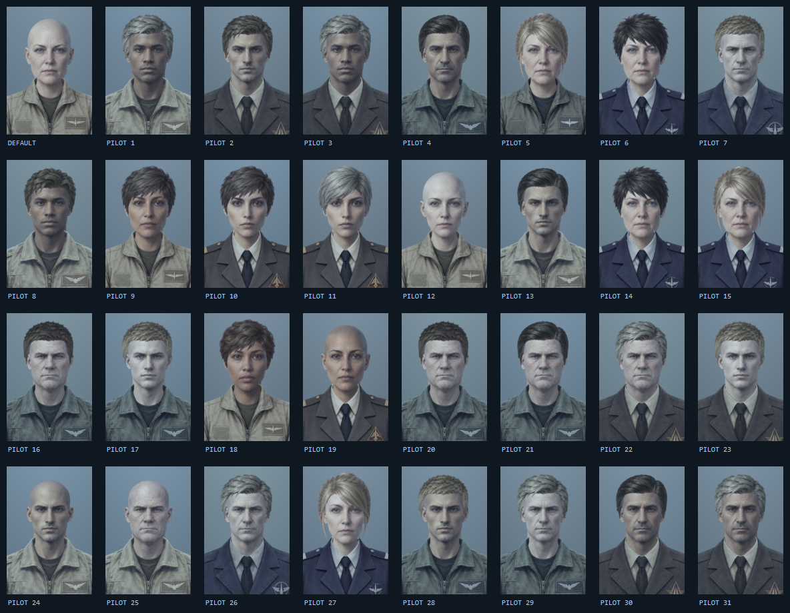

# Pilot dossier paper dolls

All art was created from scratch for this set. The previous faces, hair,
uniforms and accessory sheets have been removed. The look follows the supplied
Ace Combat dossier references: soft painted faces, slightly blurred detail,
restrained expressions, muted cloth and cool portrait lighting. Identities and
uniform insignia are original designs.

## Delivered assets

`layers.png` is the only embedded runtime asset: **512 × 1536 RGBA**, containing
32 registered **128 × 192** cells. The six separate sets below also have real
alpha and already use those same portrait coordinates. Overlay a cell from
each set without resizing or repositioning it.

| Set | Atlas tiles | Separate sheet |
| --- | --- | --- |
| Male faces | 0–5 | `male-faces.png`, 3 × 2 cells |
| Female faces | 6–11 | `female-faces.png`, 3 × 2 cells |
| Male hair | 12–17 | `male-hair.png`, 3 × 2 cells |
| Female hair | 18–23 | `female-hair.png`, 3 × 2 cells |
| Male uniforms | 24–27 | `male-uniforms.png`, 2 × 2 cells |
| Female uniforms | 28–31 | `female-uniforms.png`, 2 × 2 cells |

Uniform reading order and selectors are **0 BDF flight, 1 BDF dress,
2 PALA flight, 3 PALA dress**. Hair selector 0 is bald, 1–6 select the six
hair cells. Composition is background → face → uniform → hair.

## Faction direction

The [BDF wiki](https://nuclearoption.wiki.gg/wiki/BDF) describes a democratic
republic and temperate/grey camouflage. Its uniforms here use olive-grey flight
cloth, slate-navy dress tunics, silver details and newly imagined round winged
insignia. The [PALA wiki](https://nuclearoption.wiki.gg/wiki/PALA) describes an
alliance emerging from revolution, with desert territories and camouflage.
Its uniforms use sand/stone flight cloth, warm charcoal dress tunics, bronze
details and newly imagined triangular alliance insignia. These uniform cuts
and badges are artistic interpretations, not claims about canonical uniforms.

Both genders have a shared six-face population: three faces with a northern
European lean, two Mediterranean faces and one brown mixed-heritage face,
with adult age variation. Following the requested shared-population direction,
all faces and hair remain usable with either faction. Seeded generation leans
toward the first half for BDF and the second half for PALA, while retaining a
one-third unrestricted draw. Custom choices are never restricted by faction.

## Rebuild and verification

`Source/` contains the six generated production sheets on a deliberately flat
magenta matte. `pack.ps1` removes and decontaminates that matte before filtering,
then exports the transparent sets and the runtime atlas. Each body has one
profile: one isotropic scale per layer kind, shared by every cell of that kind.
Faces use 0.80; hair uses 0.76 male / 0.78 female, with tops at 12 / 9. Source padding
is aligned by the same rule for every cell.
Uniforms use a 1.50 male / 1.45 female crop factor and collar-top position 106,
so shoulders extend past the frame and the transparent neck opening fits the
head. The same transform applies to the cloth and its alpha mask; each body's
four uniforms share it. Face registration is unchanged.
There are no individual sprite scale overrides, stretched necks, equipment
layers, or individual collar masks. A shared neck silhouette excludes shoulder
stubs beneath clothing. Cells are isolated before filtering to prevent adjacent
rows bleeding into the portrait.
Soft matte edges borrow nearby opaque foreground colour before resampling,
preserving alpha while removing the pink fringe around hair and collars.

```powershell
pwsh -NoProfile -File Assets/Pilots/pack.ps1
pwsh -NoProfile -File Assets/Pilots/preview.ps1
pwsh -NoProfile -File Assets/Pilots/preview.ps1 -All
pwsh -NoProfile -File tests/PortraitRegistration.ps1
dotnet test tests/WingCommand.PureTests/WingCommand.PureTests.csproj --filter "FullyQualifiedName~PilotGenerationTests|FullyQualifiedName~CustomPilotCodecTests"
```

`preview.png` shows 32 seeded pilots. `compatibility.png` shows all **336**
body/face/hair/uniform combinations. The atlas check covers 48 neck/uniform
pairings, full-width shoulder coverage, silhouette bounds, matte removal and resampling bleed. The pure tests
cover deterministic selections, mixed faction pools, layering and old imports.

Accessories are absent from the Studio and compositor. Existing v2 custom-pilot
JSON remains readable: obsolete accessory values are ignored, and new exports
omit that field. Saved face/hair/uniform indices now refer to this replacement
art. No network or image-generation service is used at runtime.


