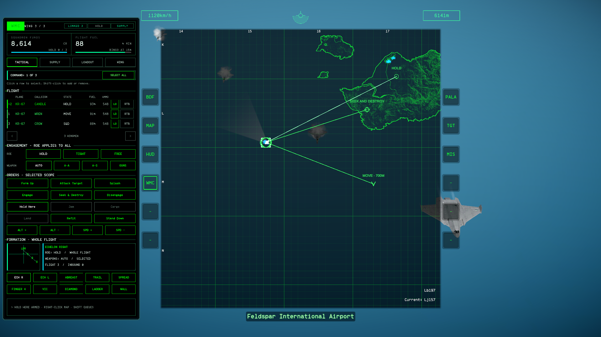
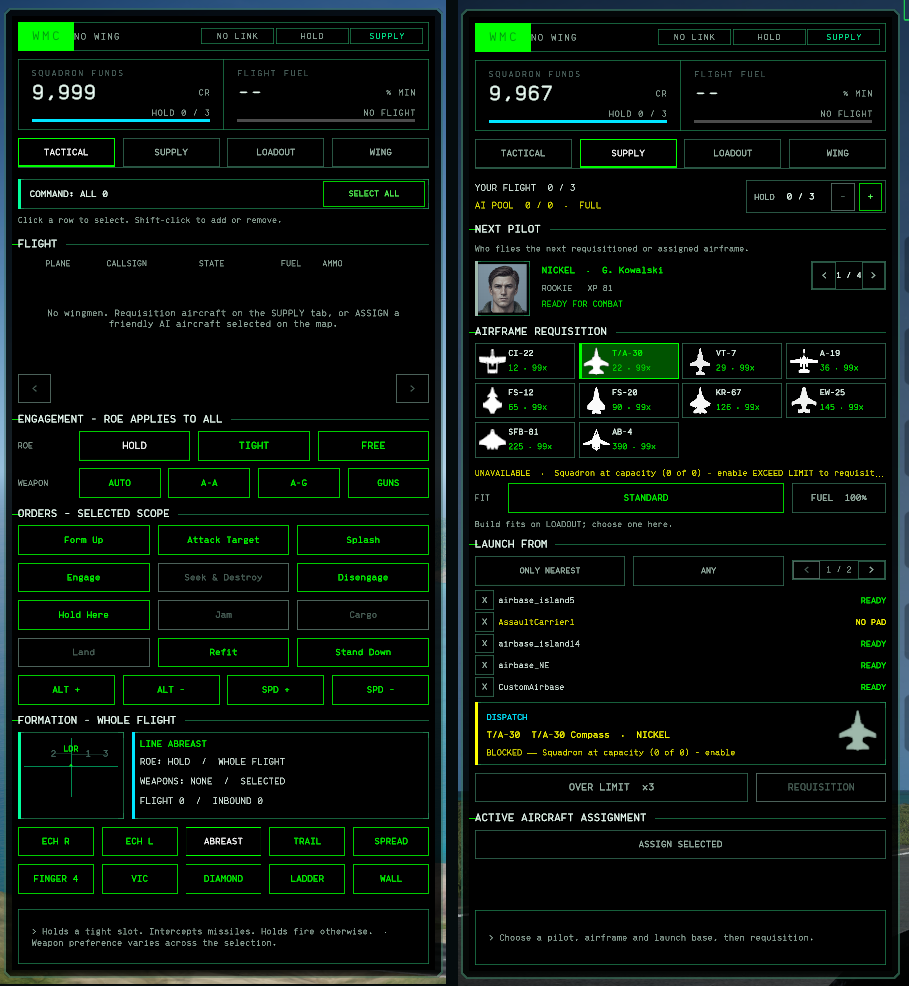
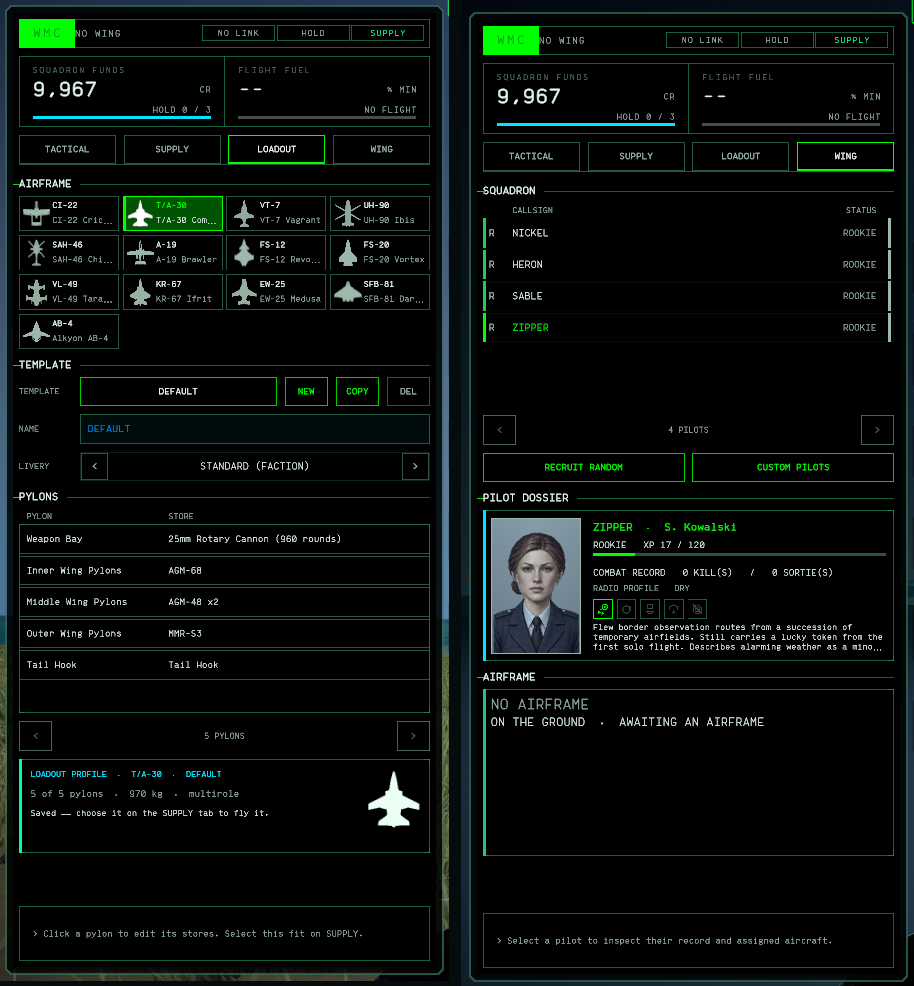
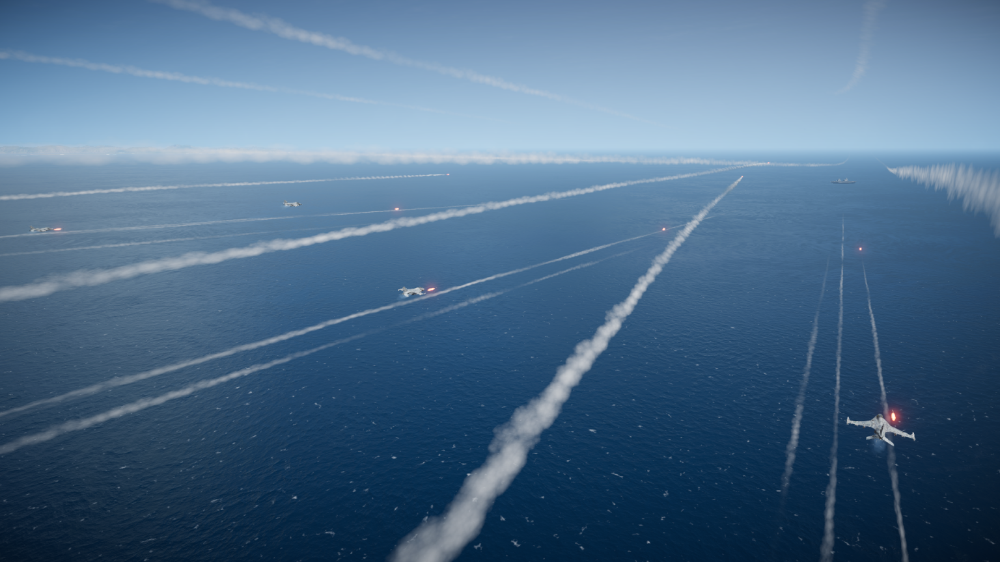
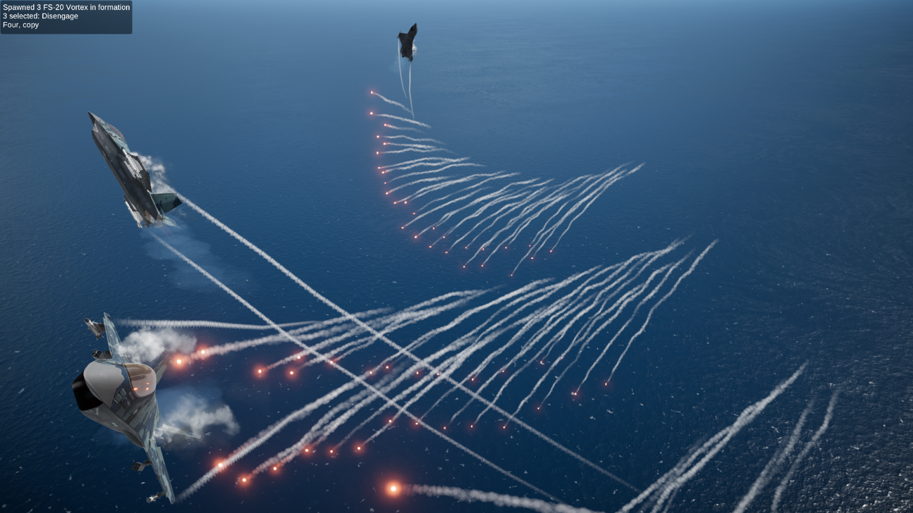

<div align="center">

# ✈ WING COMMAND
### Tactical AI wing control for Nuclear Option

[](https://github.com/GrabowMar/NuclearOption-WingCommand/releases)
[](https://store.steampowered.com/app/2247020/Nuclear_Option/)
[](https://github.com/BepInEx/BepInEx/releases)
[](LICENSE)

**Stop babysitting one wingman at a time. Command the whole squadron like a flight lead.**

[Install](#-install) • [Quick start](#-quick-start) • [Orders](#-orders) • [Supply](#-squadron-supply) • [Config](#️-configuration) • [FAQ](#-faq)

</div>

---

> [!NOTE]
> Nuclear Option's AI is host-controlled. WingCommand works fully in **single-player** and
> for the **host** of a multiplayer match. Joining someone else's server, you can't
> reliably command AI — a game limitation, not a bug.

> [!IMPORTANT]
> Active development: balance and controls shift between releases, and the squadron shop
> can make missions much easier. Pace yourself.

## What it does

WingCommand turns your wing into a squadron. It works independently of Boscali Summer;
when both are installed, Boscali handles the MFD layout.

- 🎯 **Tactical control** — select wingmen on the map, build a scope, issue scoped orders
- 🔧 **Loadout editor** — per-pylon templates from the airframe's own stores, saved across missions
- 🛩️ **Six formations** — Finger Four, Combat Spread, Trail… with smooth transitions
- 🛡️ **Self-preservation** — wingmen react to missiles, terrain and threats on their own
- 💰 **Squadron economy** — buy airframes, hold a reserve, requisition replacements mid-mission
- 🎖️ **Persistent pilots** — callsigns, ranks and records that grow, plus a radio that answers
- 💀 **Takeover** — lose your jet, jump into a surviving wingman and keep fighting
- 🚫 **Deconfliction** — the wing spreads fire across targets instead of dogpiling one

## 📸 Screenshots

<p align="center">
  <br>
  <sub>Tactical map — select wingmen and issue individual orders</sub>
</p>

<table align="center">
  <tr>
    <td align="center" colspan="2"><br><sub>Tactical + Supply — command the flight and requisition aircraft</sub></td>
  </tr>
  <tr>
    <td align="center" colspan="2"><br><sub>Loadout + Wing — configure aircraft and meet the pilots</sub></td>
  </tr>
  <tr>
    <td align="center" width="50%"><br><sub>The wing in combat</sub></td>
    <td align="center" width="50%"><br><sub>Defensive break — hamsters doing hamster things</sub></td>
  </tr>
</table>

## 📦 Install

**NOMM (recommended):** install [NOMM](https://github.com/Combat787/NOMM), search **WingCommand**, install, launch.

**Manual:**

1. Install [BepInEx 5](https://github.com/BepInEx/BepInEx/releases) into the Nuclear Option folder and launch the game once.
2. Take `WingCommand.dll` from the [latest release](https://github.com/GrabowMar/NuclearOption-WingCommand/releases) and place it at:

   ```text
   Nuclear Option/BepInEx/plugins/WingCommand/WingCommand.dll
   ```

3. Launch and check `BepInEx/LogOutput.log` for `WingCommand 0.9.2.1 loaded.` — if it's missing, see [Troubleshooting](#-troubleshooting).

> [!WARNING]
> Keep the DLL only in `plugins/WingCommand/`. A stray copy in `plugins/` can load the wrong build.

## 🚀 Quick start

1. **Load a mission** as host or single-player.
2. **Get a wing.** **WMC → Supply**: select friendly AI on the map and press **Assign Selected** (once for the price, again to confirm), or requisition fresh airframes from the catalogue.
3. **Take control.** **WMC → Tactical**: click a wing icon or roster row to select one, Shift-click to add, **Select All** for everyone.
4. **Order.** Try **Hold Here** — the button highlights, then right-click the map.
5. **Kit them out.** Build a template on **WMC → Loadout**, pick it in the **FIT** row on **Supply** before requisitioning.
6. **Or the radial.** Open the normal radial menu → **Wing Command** for instant whole-wing orders.

Fixed-wing and rotary can't share a formation; the shop and recruit lists filter incompatible types automatically.

## 🕹️ Command interfaces

**Radial** — fast, always **whole-wing**. Recruitment/release/requisition are deliberately absent.

```text
Wing Command
├─ Combat: Attack Target · Engage · Splash 'Em · Disengage
├─ Flight & Tasking: Form Up · Hold Position
│  └─ Special Tasking: Jam Target · Deliver Cargo · Land Here
├─ Formation: Echelon Right · Line Abreast · Trail · Combat Spread · Finger Four · Vic
├─ Rules Of Engagement: Defend · Escort · Free
└─ Manoeuvres
   ├─ Combat: Break Left/Right · Split-S · Immelmann
   └─ Aerobatics: Barrel Roll · Aileron Roll · Loop · Wing Waggle
```

**WMC screen** — precise, **scoped** orders. Four tabs:

- **Tactical** — roster, command selection, ROE, preferred weapon, formations, scoped orders, map-order status.
- **Supply** — funds, wing size, squadron capacity, the faction catalogue at list price, the FIT each requisition carries, and a three-airframe reserve.
- **Loadout** — per-pylon editor for named templates: the airframe's own hardpoints, stores and exclusion rules.
- **Wing** — one wingman's fuel, ammo, cargo, hull and current order, plus its pilot's callsign, rank and record.

**Tactical map** (WMC → Tactical open):

| Do this | Get this |
|---|---|
| Click a wing icon | Select just that wingman |
| Shift-click another icon / roster row | Add or remove it |
| **Select All** | Command the whole wing |
| Left-click Hold Here / Seek & Destroy / Land / Cargo | Arm that order (button stays highlighted) |
| Left-click Attack Target with contacts designated | Attack them immediately; Attack stays armed |
| Left-click Attack Target with no designation | Arm Attack for a map target |
| Right-click the map with an order armed | Issue that order at the point, or at the clicked hostile for Attack |
| Right-click the map with no order armed | Send the selection there (`MOVE` marker) |
| Shift-right-click | Queue that order (Move only appends to an existing Move; otherwise it replaces) |
| H+ / H- / S+ / S- | Change Move altitude and speed |
| Click the armed button again / Escape | Cancel the armed order |

Other map icons retain their stock left-click behaviour. Closing Tactical restores
normal wing-icon clicks. Move routes end by rejoining; Seek & Destroy starts
engagement at the destination. Selected recipients show brackets; **Clear Targets**
does not clear command selection.

## Tactical pages, flight groups and patrols

Tactical has **Combat**, **Tasking** and **Route** order pages, plus **Formation**
and **Manoeuvres** selectors. Changing pages disarms map placement without changing
your selection or standing orders. Formation and ROE apply to the whole flight.

**FLIGHT [+]** expands the roster from three to six aircraft per page and reveals
flight groups. Use page arrows or scroll for larger wings.

- Select aircraft, press **CREATE GROUP**, enter a name and **SAVE**. Up to three groups per mission.
- Click a group to recall it; **EDIT GROUP** saves its name and current selection. **DELETE GROUP** leaves the aircraft assigned.
- While expanded, **Ctrl+1/2/3** recalls groups; **Ctrl+Shift+1/2/3** updates membership. Lost aircraft are pruned; groups reset on mission exit.

**Patrol:** on Route, right-click a Move point and Shift-right-click to add more.
With at least two distinct points, enable **PATROL** to loop. Turning it off finishes
the remaining route, then rejoins; a replacement order cancels the loop.

**Refit** saves the current task, route, patrol and Move settings, then resumes after
landing, rearming and takeoff. Invalid targets are skipped. A new order or roster RTB
cancels the saved plan.

**AUTO REFIT** opts selected aircraft into refit-and-resume at bingo fuel or empty
combat stores. It is off by default, requires `Engagement/AutoReturnOnEmpty`, and
leaves deliberate landing, cargo, disengagement, manoeuvre and Stand Down tasks alone.
Unarmed aircraft refit for fuel only.

## 📋 Orders

| Order | What it does |
|---|---|
| **Form Up** | Close on assigned slots and hold station on you |
| **Attack Target** | Hit your locked target immediately, or arm the button and right-click a hostile on the map. Radial sends everyone; scoped WMC distributes contacts and may hold surplus back as cover |
| **Splash 'Em** | Every selected wingman pours its whole loadout into one target until it's dead or they're dry. WMC only — not a quick call |
| **Engage** | Hunt within the configured leash, return if they stray. Sets ROE to FREE |
| **Seek & Destroy** | Fly to a marked map area, then begin autonomous engagement under the current ROE |
| **Disengage** | Break on separated headings, countermeasure, egress, then form up |
| **Hold Here** | CAP a point while still applying ROE |
| **Deliver Cargo** | Fly cargo to a chosen point, drop it, report, rejoin |
| **Land Here** | Set compatible helicopters down near the point |
| **Refit** | Return to base, replenish fuel and stores, take off again, then resume the saved task and route |
| **Stand Down** | Cancel the current task and loiter near friendly airbases or ships |
| **Roster RTB** | On an individual roster row, dismiss a wingman home; its plane and pilot return to their pools after recovery |
| **Formation dial** | Swap between the six shapes on the fly |

Orders survive missile defence and temporary recall, including orders issued while
defending. Ordinary bingo return ends the task; **AUTO REFIT** preserves it.
Completed manoeuvres and attacks on destroyed targets return to formation.

**Attack vs Splash:** Attack spreads targets, caps useful attackers and spaces launches.
Splash concentrates fire on one target without those limits, while retaining weapon
matching and shot envelopes. It starts without formation recall, continues without a
leader, and resumes after missile defence or terrain avoidance. Bingo and Winchester
still recall it.

**Roster RTB:** after landing at a friendly base, the pilot returns to the pool,
the airframe returns to faction stock and its purchase allocation is refunded.
Set `Engagement/RtbReturnsToReserve = false` to park instead of despawning.

## 🎯 Rules of engagement

ROE controls incidental fire during formation, holding and temporary recall.
Explicit Attack and Splash orders authorize their designated targets.

| ROE | Weapons policy | Under fire |
|---|---|---|
| **Defend** (`Hold` in config) | Incoming missiles only | Tries to intercept the missile |
| **Escort** | Air threats around the formation | Prioritises the threat to you |
| **Free** | Any valid opportunity target in range | Fires while holding the current task |

ROE does not change the flight task. Missile defence takes priority, then resumes
the standing order. During Attack recall, the target is remembered but firing follows
ROE until the attack resumes. Missile interception remains available during Jam.

## 🛩️ Formations

| Shape | Best for |
|---|---|
| **Echelon Right** | General-purpose swept line, elements staggered |
| **Line Abreast** | Broad sensor and weapons frontage |
| **Trail** | Spaced column with a bounded step down |
| **Combat Spread** | Wide two-ship elements in an offset box |
| **Finger Four** | Asymmetric four-ship elements, repeated for larger wings |
| **Vic** | Balanced V for compact groups |

Slots transition smoothly, compress during hard turns and keep clear of terrain.
Wingmen adjust spacing, throttle and braking for closure, aircraft condition and
pilot experience; terrain and collision avoidance take priority.

- **Slow leader:** fixed-wing followers announce **holding wide** and circle safely until you maintain enough speed.
- **Overshoot:** nearby, aligned followers take a separated lane until you pass; distant aircraft use a curved rendezvous to catch up.
- **Leader landing:** formation followers orbit the field and rejoin after takeoff. Explicit orders stay active.
- **Departures and returns:** aircraft use native taxi, takeoff and landing states. Purchases are queued per field; refit replenishes and relaunches from the landing position.

Echelon Left, Diamond, Ladder and Wall remain readable from old configs but are
absent from the selector. With verbose logging enabled, instability triggers short
`[FormationControl]` diagnostic bursts; include these when reporting flight issues.

## 🔫 Preferred weapon

Set per selection on **WMC → Tactical**; shown in the roster and HUD.

| Setting | Effect |
|---|---|
| **AUTO** | Most effective ready station for the target |
| **A-A** | Prefers aircraft and anti-air stores |
| **A-G** | Prefers surface contacts and anti-surface stores |
| **GUNS** | Prefers close-in stores, saving standoff weapons |

Preferences are a bias: unavailable or out-of-range stores fall back to another
usable weapon.

## 🧰 Loadouts

Build named templates on **WMC → Loadout**, then choose one in Supply's **FIT** row
before requisitioning.

1. Pick an airframe and press **+** for a new template.
2. Select a pylon and choose from the aircraft's own stores, or leave it empty. Paired pylons move together; incompatible fits show `BLOCKED`.
3. Name and save it. Up to eight templates per airframe persist in config.

**STANDARD FIT** uses the aircraft menu's current mission loadout. Templates apply
when an aircraft is created; existing AI keeps its equipment. Deleting a template
leaves airborne aircraft untouched and resets pending selections to Standard.
Loadouts do not change the purchase price.

**Deliver Cargo:** choose the order and right-click a drop point. Helicopters set
cargo down; fixed-wing aircraft release on a pass. Click the armed button again to
use the game's supply route instead. Empty aircraft rejoin; failed drops are reported.

## 🛒 Squadron supply

Supply uses the game's faction stock and your allocation. Costs are previewed
before confirmation; failed recruitment or launches roll back the purchase.

- **Requisition:** aircraft list price, including the chosen loadout. Purchases queue through a compatible airfield or hangar.
- **Assign existing AI:** 25% of list value by default (`Shop/RecruitmentCostPercent`); the same persistent aircraft is not charged twice.
- **Wing Reserve:** **HOLD** keeps up to three airframes out of AI-accessible stock; **RELEASE** returns them.
- **Release a wingman:** it stops counting against your wing limit and flies home. Successful recovery returns its pilot and airframe, refunding purchase allocation. Assignment fees are not refunded.

**Squadron capacity:** missions cap airborne faction AI, with less room per friendly
player. Supply shows `SQUADRON active / limit`. **OVER LIMIT** requires rank 3 and
permits four extra purchases airborne at once, at **3× list price**. The surcharge
applies only when the purchase exceeds the cap.

## 🧠 AI coordination and self-preservation

**Deconfliction:** AI shares target reservations to spread fire across comparable
threats. Explicit attacks keep surplus aircraft as cover; missile defence assigns
one interceptor per inbound. Native weapon, range and threat checks still apply.

**Defensive response:** wingmen react to their own missile warnings with appropriate
steering, countermeasures and jamming. They call **DEFENSIVE**, then resume the queued
order after the warning clears—including commands issued during evasion.

## 🎖️ Pilots and radio

**WMC → Wing** shows callsign, background, rank, record and a generated portrait.
Pilot Studio, Wing and Supply share the same appearance, including imported pilots.

Pilots retain their records through aircraft changes **within the current mission**;
there is no campaign save. Recovery returns them to the pool, while killed pilots stay lost.

- **Ranks:** Rookie → Wingman → Veteran → Ace → Legend at **0 / 120 / 360 / 720 / 1200 XP**.
- **XP:** 25 per kill, 40 per recovered sortie and 10 per survived engagement.
- **Perks:** one unique random perk per promotion, up to four. Imported veterans receive their earned ranks' perks.
- **Rank effects:** modest weapon and formation bonuses. `RankEffect = 0` disables effects; `PilotProgression = false` also stops XP. Records remain available.

| Perk | Survival effect |
|---|---|
| **LUCK** | 30% chance per incoming missile to bias guidance 350m sideways; proximity blasts still hurt. |
| **FUEL DISCIPLINE** | 30% less engine fuel consumption. Leaks and fires remain dangerous. |
| **TOUGHNESS** | 35% less seated-pilot damage; does not strengthen the airframe. |
| **G TOLERANCE** | 75% less pilot damage from extreme G loads. |
| **COMMANDO** | One 50% escape chance after landing alive; return after 120 seconds if still free and alive. |
| **FIREPROOF** | 75% less fire damage to the seated pilot. Does not extinguish the aircraft. |
| **BLAST SURVIVOR** | 60% less explosion damage to the seated pilot. |
| **BALLISTIC VEST** | 60% less projectile damage to the seated pilot. |
| **CRASH TRAINING** | 60% less impact damage to the seated pilot; aircraft can still be destroyed. |
| **SECOND CHANCE** | Survive one otherwise fatal seated-pilot hit at 1 HP per sortie. Rearmed by assignment or successful base sortie; subsequent damage can kill. |
| **COOL HEAD** | 40% less engine fuel use while a native incoming-missile warning is active. |
| **HIGH ALTITUDE CRUISE** | 40% less engine fuel use above 3000m AGL. |
| **LOW LEVEL EVASION** | 25% guidance-error chance per incoming missile, rolled when first encountered below 300m AGL. |
| **RADAR GHOST** | 30% guidance-error chance per incoming ARH or SARH missile. |
| **HEAT GHOST** | 30% guidance-error chance per incoming IR missile. |
| **NOTCH EXPERT** | 40% guidance-error chance against radar missiles first encountered within 15 degrees of a beam approach, while moving over 30m/s. |
| **CHAFF REFLEX** | Fitted chaff dispensers have 50% shorter burst intervals; uses ammunition faster. |
| **FLARE REFLEX** | Fitted flare dispensers have 50% shorter burst intervals; uses ammunition faster. |
| **ECM SPECIALIST** | Fitted self-protection radar jammer produces 75% stronger ECM at normal power cost. |
| **FAST LEARNER** | 50% more XP from every award, reaching ranks and survival perks sooner. |
| **QUICK DRAW** | 35% shorter wing weapon-command intervals; native reload and lock requirements still apply. |
| **STANDOFF** | 25% larger wing weapon-employment envelope; native weapon readiness still applies. |
| **SURVIVALIST** | 60% less incoming projectile, blast and fire damage to the dismounted pilot before native armour calculations. |
| **PATHFINDER** | 35% independent escape chance with a 60-second return delay; with Commando, 67.5% chance and 60 seconds. One roll per ejection. |

Guidance-error perks combine independently up to an 80% cap, with one roll per
missile/pilot pair at first encounter. Fuel savings multiply down to a 25% consumption
floor; damage resistances also multiply. No perk guarantees survival.

**Search and rescue:** confirmed survivors become **DOWNED** and cannot be reassigned.
Friendly rescue restores the same pilot; enemy capture shows **CAPTURED**, confirmed
death **KIA**, and an unknown disappearance **MIA**.

Downed pilots have a red map outline and **SAR · CALLSIGN** label. On Wing:

- **AIR SAR** sends the nearest eligible idle wing helicopter with capture capacity and over 25% fuel. It lands nearby for native pickup and stays there afterward. Terrain and enemy fire can prevent rescue; water hoists remain manual.
- **LOCAL 10M** costs 10,000,000 funds immediately and takes five mission minutes. Death or capture cancels recovery without a refund.

**Radio:** pilot-specific subtitles and optional radio clicks report commands, threats,
losses and departures. Group orders get one lead acknowledgement; urgent calls take
priority. Configure `Comms/Radio` as `Off`, `Text` or `TextAndTone`.

## 💀 Takeover

After you are killed or eject, surviving wingmen hold in orbit and a takeover window
opens. Pick one (number keys work) to continue with its airframe, loadout, fuel,
livery and motion. Available in single-player and as host; controlled by
`Engagement/TakeoverOnDeath`. Normal respawn remains available.

## 🗺️ HUD and map

- Wingmen have green outline rings; their targets have amber rings. Tactical selection adds brackets while preserving native faction fills and headings.
- The compact roster shows order/state and live **slot error**, hiding while the map is open.
- Map lines show destinations, queued route legs and attack targets.

**Slot error:** small and steady means established; oscillating suggests excessive
correction; continually growing means the follower cannot keep up or lacks local
control. `-` means it is not following a formation order.

## 💡 Tips

- **Buy first, select second** — Tactical selection means nothing until you own AI pilots via Supply.
- **One template per job** — an A-A sweep fit and a strike fit, named, one dropdown apart.
- **Empty pylons are free performance** — the summary line shows the weight coming off.
- **Shift-click for surgical strikes** — send two to flank while the rest hold on you.
- **Save Splash 'Em for something worth it** — great on a ship, terrible on a jeep.
- **Widen before the merge** — Combat Spread or Line Abreast beat a tight Trail for not getting bracketed.
- **Reserve your favourite airframe** so a lucky kill doesn't cost another purchase.
- **Check `SQUADRON active/limit`** before panic-buying — an empty shop usually just means the AI cap is full.

## ❓ FAQ

**Multiplayer?** Single-player and host only; AI is host-controlled.

**Other mods?** BOTE radial submenus are supported. Boscali Summer is optional and
handles MFD layout when installed; otherwise WMC fits beside the native bezel.

**Templates?** No extra loadout charge. They live in config under
`Loadout/SavedTemplates`. A `BLOCKED` pylon means another fitted store excludes it.

**Mixed helicopters and jets?** No. Supply and recruitment filter incompatible types.

**Full squadron?** Check `SQUADRON active/limit`; **OVER LIMIT** becomes available at rank 3.

**Buying the same aircraft again?** RTB refunds its purchase allocation and returns it
to stock. Requisitioning it again is a new purchase.

**Game updates?** The badges show the targeted version. If a native radial hook breaks,
use the command-wheel keybind until the mod is updated.

## 🔧 Troubleshooting

<details>
<summary><strong>Wing Command doesn't show up in the radial menu</strong></summary>

- Confirm `WingCommand.dll` is inside `BepInEx/plugins/WingCommand/`, with no older duplicates elsewhere.
- Check `LogOutput.log` for the version + Harmony patch lines from the install steps.
- If a game update broke the native radial hook, bind the fallback radial key in advanced settings.
</details>

<details>
<summary><strong>Aircraft won't follow orders</strong></summary>

- Confirm you're **host** or single-player.
- Fixed-wing and rotary can't share a formation.
- **Deliver Cargo** needs a carried load; **Land Here** is compatible-helicopter only.
- An aircraft already landing, destroyed, or not locally simulated can't take new orders.
</details>

<details>
<summary><strong>Formation flying looks unstable</strong></summary>

- Reset `Formation/Spacing` to default (120m) if altered.
- Make sure you're not outrunning the wingman's performance envelope.
- Turn on `Debug/VerboseLogging` and check slot error before filing a bug.
</details>

<details>
<summary><strong>The Loadout tab only offers the standard fit</strong></summary>

- Some airframes publish no readable hardpoint data; the tab says so and that aircraft flies its own fit.
- If *every* airframe reads that way, a game update likely moved the weapon-station members —
  check `LogOutput.log` for a `[Loadout]` warning. The mod degrades to standard fits on
  purpose rather than fitting the wrong weapons.
</details>

Found a bug? [Open an issue](https://github.com/GrabowMar/NuclearOption-WingCommand/issues)
with your game version, the aircraft/order/formation involved, and the relevant `LogOutput.log` lines.

## ⚙️ Configuration

Settings live in `BepInEx/config/com.marci.wingcommand.cfg`. Edit them in-game with
[ConfigurationManager](https://github.com/BepInEx/BepInEx.ConfigurationManager) (**F1**).
Flight laws, bank limits, and integration safety floors are fixed in code, while preference,
tactical rules, hotkeys, and appearance can be configured.

| Section | Setting | Default | Purpose |
|---|---|---:|---|
| AI | `Mode` | `Smart` | `Smart` (full AI passes) or `Performance` (lean updates for heavy MP hosts) |
| AI | `AiSharpTurns` | `true` | Enable sharp, rapid combat manoeuvres (high-bank slice turns, corner-speed airbraking, coordinated rudder kicks, elevated pitch authority) for fixed-wing aircraft. |
| AI | `AiTargetSpreading` | `true` | Enable AI target spreading on the next target selection; still disabled in Performance mode. |
| AI | `AiMissileWarningRepair` | `true` | Repair warning subscriptions on the next combat entry. Disabling leaves existing subscriptions intact. |
| Formation | `Shape` | `EchelonRight` | Initial formation at mission start |
| Formation | `Spacing` | `120` | Lateral and longitudinal slot spacing in metres (`50`–`300`) |
| Engagement | `DefaultRoe` | `Hold` | Initial ROE (`Hold`, `Tight`, `Free`) |
| Engagement | `AutoReturnOnEmpty` | `true` | Auto RTB on Winchester or bingo |
| Engagement | `BingoFuel` | `0.15` | Auto-return fuel fraction (`0.05`–`0.40`) |
| Engagement | `LeashDistance` | `5000` | Max pursuit distance in metres before breaking off and rejoining (`2000`–`15000`) |
| Engagement | `MaxWingmenPerTarget` | `2` | Maximum wingmen allowed to focus-fire the same target (`1`–`4`) |
| Engagement | `RtbReturnsToReserve` | `true` | RTB despawns, refunds purchase allocation, returns pilot and airframe |
| Engagement | `TakeoverOnDeath` | `true` | Offer a surviving wing aircraft after pilot loss |
| Comms | `Radio` | `TextAndTone` | Squadron radio traffic (`Off`, `Text`, `TextAndTone`) |
| Pilot | `PilotProgression` | `true` | Pilots keep a record, rank and small skill effect |
| Pilot | `RankEffect` | `1.0` | Multiplier on rank shooting bonuses (`0` = cosmetic progression only) |
| Shop | `ShopEnabled` | `true` | Enable purchasing wingmen from faction supply |
| Shop | `RecruitmentCostPercent` | `0.25` | Active-AI reassignment fee, fraction of list value (`0.0` = free) |
| Loadout | `SavedTemplates` | `""` | Your saved per-pylon templates (managed by WMC) |
| Keys | `WingMenu` | `C` | Hold for the command wheel; aim and release to confirm, right-click to cancel. Set `None` to disable. |
| Keys | `QuickRejoin` | `None` | Optional hotkey: whole wing rejoins formation |
| Keys | `QuickEngage` | `None` | Optional hotkey: whole wing engages |
| Keys | `QuickDisengage` | `None` | Optional hotkey: whole wing falls back / disengages |
| Keys | `QuickAttackTarget` | `None` | Optional hotkey: attack player's targeted contact |
| Keys | `CycleRoe` | `None` | Optional hotkey: cycle ROE (Hold → Tight → Free) |
| UI | `ShowWingHud` | `true` | Compact roster docked beside the tactical map |
| UI | `WingHudX` / `WingHudY` | `0` / `0` | Live roster offsets in F1, in scaled HUD units. +X moves right, +Y moves up; negative values move left/down. Reset both to zero to dock beside the map. |
| UI | `UseMfdPanel` | `true` | Cockpit MFD WMC screen alongside BDF/MAP/HUD |
| UI | `MapCommands` | `true` | Tactical wing selection and tasking on maximised map |
| UI | `Highlight` | `WingAndTargets` | Roster and target tinting (`Off`, `Wing`, `WingAndTargets`) |
| UI | `WingMemberColor` | `#39FF65` | Hex colour for wingmen across HUD and map |
| UI | `WingTargetColor` | `#FFB020` | Hex colour for units engaged by wing |
| UI | `TacticalPauseInSingleplayer` | `false` | Slow down game time when tactical command screen is active |
| UI | `TacticalPauseScale` | `0.25` | Simulation time-scale during tactical pause (`0.0` = full pause) |
| UI | `ExternalHitmarkerAudio` | `true` | Hitmarker audio confirmation in 3rd-person/orbit view |
| Debug | `EnableDebugActions` | `false` | Master switch for development cheats (host-only) |
| Debug | `VerboseLogging` | `false` | F1 “Debug action logging” switch, visible without advanced settings. Applies immediately; logs action requests/results, frame numbers, state transitions and flight diagnostics to BepInEx `LogOutput.log`. Independent of cheats. |
| Debug | `DebugSpawnAircraft` | empty | F1 aircraft selector: override the debug spawn type using compatible catalogue aircraft, including modded planes, without faction stock or rank requirements. Empty uses your current aircraft. |
| Debug | `SpawnDebugWing` | — | F1 button: spawn a full wing of the selected debug aircraft in formation; requires flying above 80 m and host authority |
| Debug | `FreePlanePurchases` | `false` | Requisitioned aircraft cost no allocation |
| Debug | `DisableWingSizeLimit` | `false` | Ignore 3-wingman squadron cap |

Debug cheats are F1-only, off by default and unsupported. The normal cap is three
wingmen; `DisableWingSizeLimit` bypasses it for testing. Retired settings are ignored.

## 🔩 Implementation

WingCommand uses native pilot states, autopilot, economy and supply calls, with
Harmony patches for integration. It adds no weapons or custom network messages.

Developed with AI coding assistance, maintainer review and live flight testing.
Contributions and test reports welcome.

## 🏗️ Building

Requires the **.NET 8 SDK**, **BepInEx 5**, and a local Nuclear Option install.
Avionics sources are included. For a custom game path, pass
`-p:GameDir="C:\path\to\Nuclear Option"`.

```powershell
dotnet build WingCommand.csproj -c Release
dotnet test tests/WingCommand.PureTests/WingCommand.PureTests.csproj
dotnet test tests/WingCommand.SurvivalTests/WingCommand.SurvivalTests.csproj
```

For both suites plus the standalone integration and portrait checks on Windows,
run `pwsh -NoProfile -File tests/Run.ps1` (PowerShell 7).
These checks cover logic and simulated game boundaries; flight feel and Unity UI still need in-game testing.

Tests run without a game install. The plugin is written to
`bin/Release/netstandard2.1/WingCommand.dll`. Attach **`WingCommand.dll`** to GitHub
releases for NOMM and manual installs.

## Licence

[MIT](LICENSE)

---

<div align="center">

**[⬆ Back to top](#-wing-command)** • Made for the Nuclear Option community

</div>
