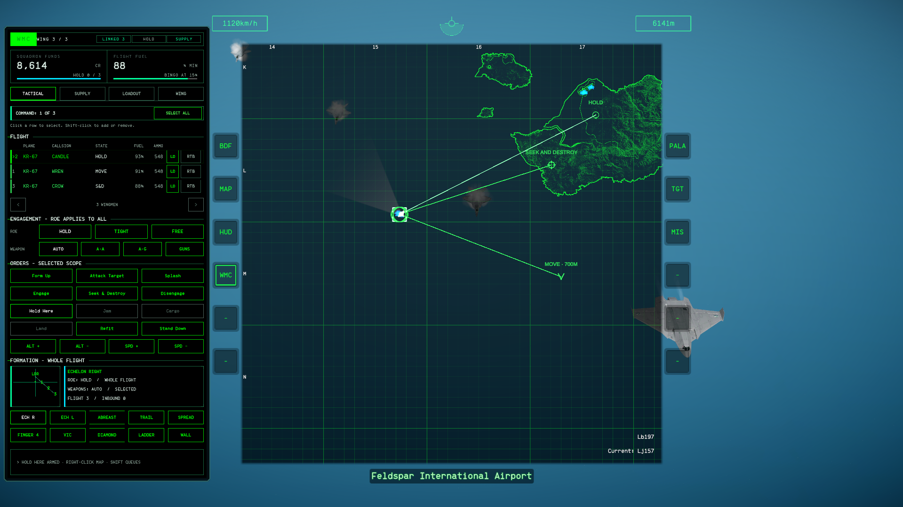
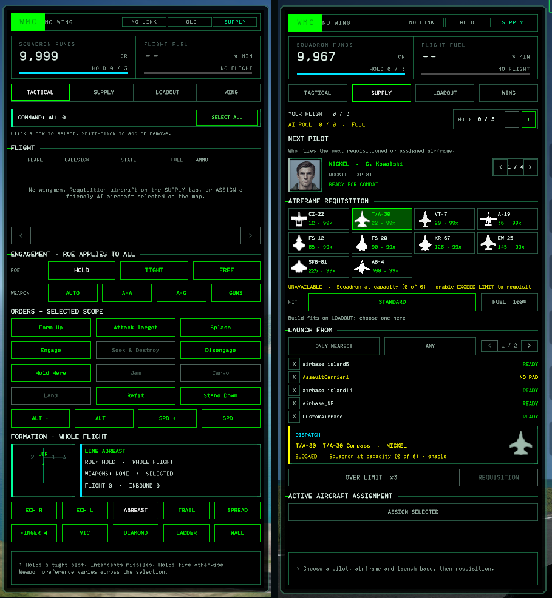
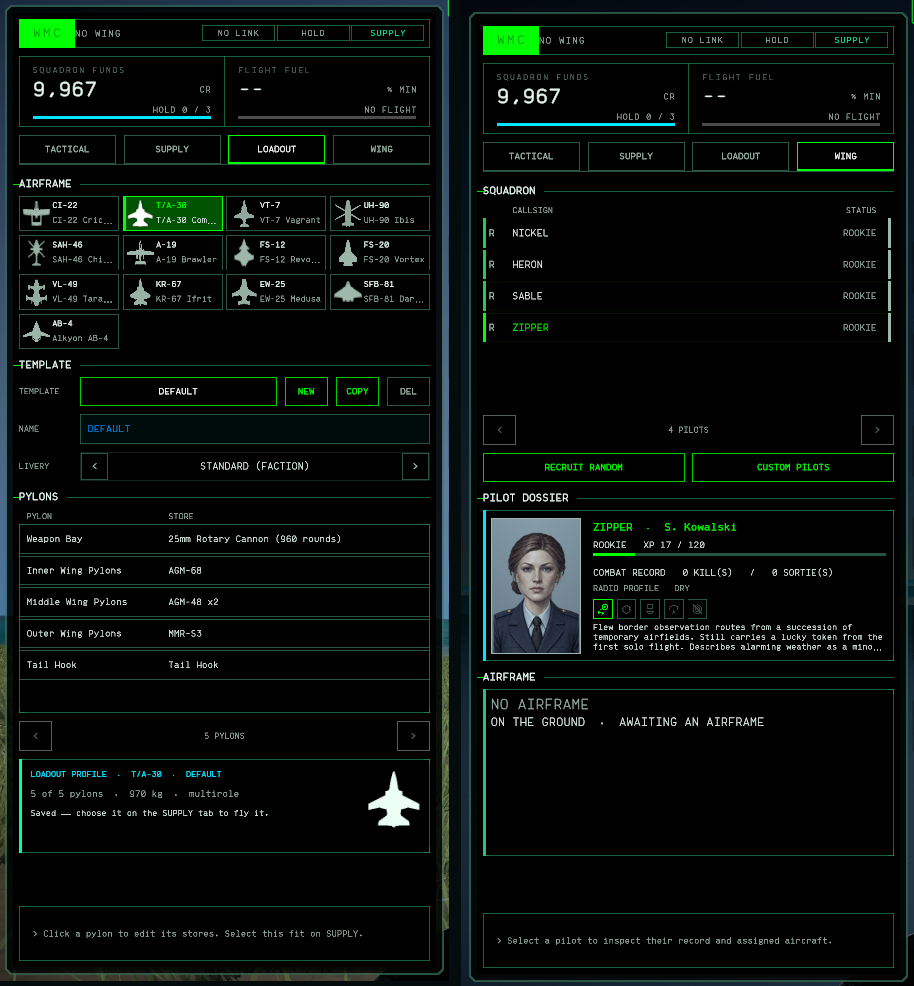
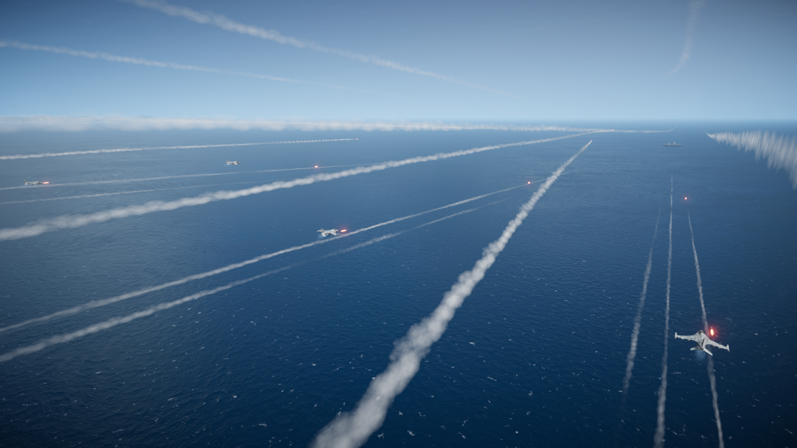
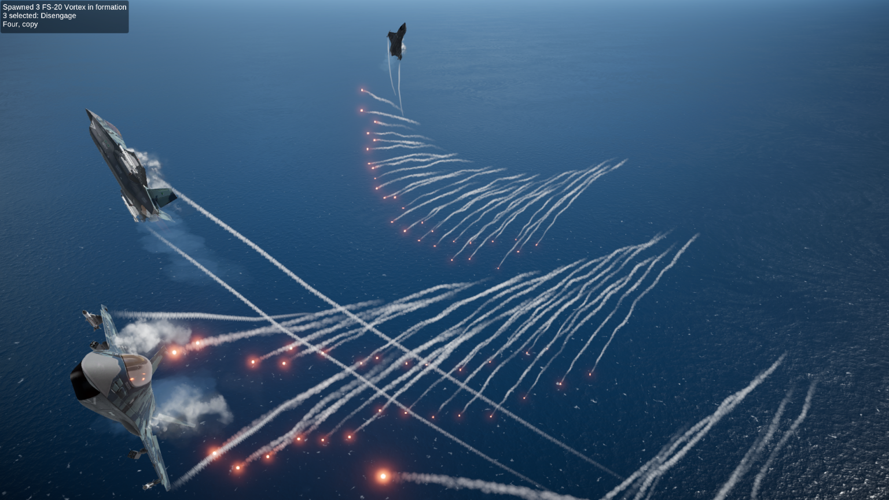

<div align="center">

# ✈ WING COMMAND
### Tactical AI wing control for Nuclear Option

[](https://github.com/GrabowMar/NuclearOption-WingCommand/releases)
[](https://store.steampowered.com/app/2247020/Nuclear_Option/)
[](https://github.com/BepInEx/BepInEx/releases)
[](LICENSE)

**Stop babysitting one wingman at a time. Command the whole squadron like a flight lead.**

[Install](#-install) • [Quick start](#-quick-start) • [Orders](#-orders) • [Supply](#-squadron-supply) • [Config](#️-configuration) • [FAQ](#-faq)

</div>

---

> [!NOTE]
> Nuclear Option's AI is host-controlled. Wing Command works fully in **single-player** and
> for the **host** of a multiplayer match. A client with the mod installed can join a host's
> game, but cannot yet see or command the host's wing — that lands in a later update.

> [!IMPORTANT]
> 1.0 is a clean-break rewrite of the AI, UI and configuration. It does **not** carry over
> 0.9.x settings, saved rosters, plans, routes or loadout templates — the first launch archives
> your old `.cfg` beside itself and starts fresh. Active development: balance and controls
> still shift between releases.

## What it does

Wing Command turns your wing into a squadron. It works independently of Boscali Summer;
when both are installed, Boscali handles the MFD layout.

- 🎯 **Tactical control** — select wingmen on the map, build a scope, issue scoped orders
- 🛩️ **Formation flying** — procedural rejoin for fixed-wing, helicopters and tiltwings, across
  about twenty shapes in four families
- 🛬 **Full ground ops** — hangar and service-point spawns, taxi, take-off, landing through the
  game's own landing AI, refit, and carrier operations
- 🗺️ **Tasking** — move, route, orbit, hold, CAP, sweep, attack, splash, engage, escort, land
  here, cargo, rescue, scout, ECM, and RTB/refit follow-ons
- 🛡️ **Combat supervision** — an outnumbered wing falls back into formation; winchester and
  bingo fuel trigger a rejoin, RTB or refit
- 💰 **Squadron economy** — requisition airframes, hold a reserve, adopt friendly AI, fit named
  loadout templates
- 🎖️ **Persistent pilots** — a roster, Pilot Studio, ranks, perks and a radio that answers, with
  optional text-to-speech
- 🕹️ **Player autopilot** — LVL, HDG, ALT, VS, SPD and NAV holds for your own aircraft
- 💀 **Takeover** — lose your jet, jump into a surviving wingman and keep fighting

## 📸 Screenshots

<p align="center">
  <br>
  <sub>Tactical map — select wingmen and issue individual orders</sub>
</p>

<table align="center">
  <tr>
    <td align="center" colspan="2"><br><sub>Tactical + Supply — command the flight and requisition aircraft</sub></td>
  </tr>
  <tr>
    <td align="center" colspan="2"><br><sub>Loadout + Squadron — configure aircraft and meet the pilots</sub></td>
  </tr>
  <tr>
    <td align="center" width="50%"><br><sub>The wing in combat</sub></td>
    <td align="center" width="50%"><br><sub>Defensive break — hamsters doing hamster things</sub></td>
  </tr>
</table>

## 📦 Install

**NOMM (recommended):** install [NOMM](https://github.com/Combat787/NOMM), search **WingCommand**, install, launch.

**Manual:**

1. Install [BepInEx 5](https://github.com/BepInEx/BepInEx/releases) into the Nuclear Option folder and launch the game once.
2. Take `WingCommand.dll` from the [latest release](https://github.com/GrabowMar/NuclearOption-WingCommand/releases) and place it at:

   ```text
   Nuclear Option/BepInEx/plugins/WingCommand/WingCommand.dll
   ```

3. Launch and check `BepInEx/LogOutput.log` for `Wing Command 1.0.0 loaded.` — if it's missing, see [Troubleshooting](#-troubleshooting).

> [!WARNING]
> Keep the DLL only in `plugins/WingCommand/`. A stray copy in `plugins/` can load the wrong build.

> [!NOTE]
> 1.0's settings and data live under a fresh `BepInEx/config/WingCommand/v1/` root (pilots,
> plans, routes, debriefs, telemetry). A pre-1.0 `.cfg` is archived beside itself, not migrated:
> your 0.9 roster, plans and routes do not carry over.

## 🚀 Quick start

1. **Load a mission** as host or single-player.
2. **Get a wing.** **WMC → SUPPLY**: select friendly AI on the map and press **ADOPT** (once for
   the price, again to confirm), or requisition fresh airframes from the catalogue.
3. **Take control.** **WMC → TACTICAL**: click a wing icon or roster row to select one,
   Shift-click to add, **ALL** for everyone.
4. **Order.** Try **HOLD** in the order grid — the button highlights, then right-click the map.
5. **Kit them out.** Build a template on **WMC → LOADOUT**, pick it from **FIT** on **SUPPLY**
   before requisitioning.
6. **Or the radial.** Open the normal radial menu → **Wing Command** for instant whole-wing orders.

Fixed-wing and rotary can't share a formation; the shop and recruit lists filter incompatible types automatically.

## 🕹️ Command interfaces

**Radial** — fast, mostly whole-wing.

```text
Wing Command
├─ Call Wingmen: Call 1 · Call 2 · Call 3 · Next Field · Adopt
├─ Form Up
├─ Formation: Next Shape · Next Family · Go High · Go Low · Level · Buster · Gate
├─ Spacing: Close · Standard · Open · Spread
├─ Autopilot: Level · Heading · Altitude · Vertical Speed · Speed · Off
├─ Combat: Engage · Attack Target · Splash · Buddy Attack · Clear My Six · Bogey Dope ·
│  Disengage · Doctrine
├─ Recover: RTB · Refit · Land Here · Take Off · Deliver Cargo · Rescue
└─ Orders: Orbit Here · Hold Here · Move Ahead · Scout Ahead · Patrol Here · Escort Target ·
   Escort Me · Dismiss · WMC
```

Requisitioning a fresh airframe from the catalogue (with a chosen fit and base) still needs
**WMC → SUPPLY**; everything above works from the cockpit.

**WMC screen** — precise, **scoped** orders on a map bezel button (maximized map). Five tabs:
**TACTICAL**, **BEHAVIOUR**, **SUPPLY**, **LOADOUT**, **SQUADRON** — see [below](#️-the-wmc-tabs)
for what each holds.

**Tactical map** (WMC → TACTICAL, or BEHAVIOUR → FORM/OPTIONS, open — right-click the maximized
map):

| Do this | Get this |
|---|---|
| Click a wing icon or list row | Select just that wingman |
| Shift-click another icon / row / element header | Add or remove it |
| **ALL** on the scope row | Command the whole wing |
| Left-click a grid order (e.g. HOLD, ORBIT, CAP, ATTACK) | Arm that order (button stays highlighted) |
| Right-click the map with an order armed | Issue that order at the point, or at the clicked hostile for ATTACK |
| Right-click the map with no order armed | Send the selection there (MOVE) |
| Shift-right-click | Queue the order |
| Click the armed button again / Escape | Cancel the armed order |

Altitude and speed for a placed order come from BEHAVIOUR → ROUTE's ALT/SPD fields (AUTO by
default). Other map icons keep their stock left-click behaviour. Map orders work with Boscali
Summer's 3D map relief: order lines and click points follow its tilted view instead of the flat
projection.

## 🖥️ The WMC tabs

**TACTICAL** — a scope row (who orders go to), the flight list (slot, type, callsign, state,
with inline **RTB** · **RDR** · **EJ** · **INSPECT ›** per wingman, under element headers), a cue
row (the armed order, or the top alert), a 4×4 order grid in four labelled rows (OFFENSE, MOVE,
DEFENSE, SUPPORT — with helicopters in scope, SWEEP becomes SCOUT and the SUPPORT row becomes
TAKE OFF · RESCUE · LAND · CARGO), and REACT below it: five one-shot maneuvers flown through the
pipeline and back to the slot (BRK L, BRK R, PULL UP, SPLIT, BEAM).

**BEHAVIOUR** — formation and standing rules, with six sub-pages:
- **FORM** — the scope element's shape (family + shape), a live plan view, and the whole wing's
  SPACING (Close/Standard/Open/Spread) and STACK (High/Level/Low).
- **OPTIONS** — the scope's engagement doctrine (PROFILE, TARGETS, RANGE, WEAPONS, RADAR) and
  the whole wing's standing rules: FALL BACK when outnumbered, what a wingman does after
  WINCHESTER and BINGO, POWER (buster/gate), and the radio (CALLS, CONTACT CALLS).
- **PLAN** — a lane per element: steps drawn on the map (MOVE, ROUTE, ORBIT, CAP, SWEEP, ATTACK,
  LAND, CARGO, RE-PLACE) with a start trigger (NOW/EXEC/T+/AFTER) and an end condition
  (ARRIVE/TIME/BINGO/WINCHESTER/TARGETS DOWN), plus EXECUTE/ABORT and PLANS › to save or load a
  plan for the current theatre.
- **ROUTE** — the scope's own quick route (draw points, set altitude/speed/action, SEND, loop
  it, save it) and MY AUTOPILOT, your own LVL/HDG/ALT/VS/SPD holds plus NAV (flies the drawn
  route, or the scope's own when nothing is drawn).
- **TIMELINE** — the plan (frozen at EXECUTE) against what actually happened, lane by lane.
- **LOG** — the wing's events and radio lines, filtered by element or the selected aircraft, with
  **DEBRIEF** for a sortie summary.

**SUPPLY** — INBOUND (launches under way) and ADOPT (friendly AI selected on the map) show only
when they have something to say, then four numbered steps in one scroll: **1 PILOT & CREW**,
**2 AIRFRAME** (tiles plus the HANGAR store), **3 FIT & FUEL** (AUTO, YOUR LOADOUT, or a saved
template; fuel at 25/50/75/100%), **4 LAUNCH BASE** (NEAREST or ANY FIELD). A DISPATCH card
pinned to the floor shows the quote and **REQUISITION · <price>**.

**LOADOUT** — a build card, airframe tiles, a template bar (NEW · COPY · DELETE, two-press), a
HARDPOINTS table (one row per station, CLEAR empties it, a store popup beside each row), and a
LIVERY pinned per airframe that new spawns wear.

**SQUADRON** — pilots, in three sub-pages:
- **ROSTER** — the mission's pilots in join order with one status word each, a dossier
  (portrait, rank and XP bar, record, radio), PERKS, and an AIRFRAME ASSIGNMENT bar with
  **AIR SAR** and **LOCAL SAR**.
- **STUDIO** — the saved pilots and the pilot studio: identity, radio, look and bio, edited as a
  draft until SAVE.
- **INSPECT** — one aircraft in depth: what it's doing, fuel, ammo, hull, radar, height and
  speed, its task, its stores by station, its pilot, its recent events, and RTB/REFIT/RELEASE
  for that aircraft alone. Inspecting never changes who orders go to.

## 📋 Orders

The order grid's cells and REACT's maneuvers, in their own words:

| Order | What it does |
|---|---|
| **ATTACK** | Right-click an enemy on the map to attack it; shift-click adds targets |
| **SPLASH** | One missile at the nearest enemy aircraft |
| **ENGAGE** | Fight the enemies in reach, then come back |
| **SWEEP** (SCOUT for helicopters) | Right-click the map: loop round a 12 km area and fight hostile aircraft found there; right-drag sets the radius. Helicopters fly a low route 20 km ahead, reporting contacts |
| **MOVE** | Right-click the map: fly there, then orbit |
| **ORBIT** | Right-click the map: orbit there |
| **CAP** | Right-click the map: orbit there and fight hostile aircraft entering 8 km of it; right-drag sets the radius |
| **HOLD** | Right-click the map: hold there |
| **DISENGAGE** | Stop fighting and rejoin |
| **FORM UP** | Back to formation on you |
| **ECM** | The scope's jammers on for a minute (only aircraft carrying one); press again to stop |
| **DETACH** | The selected wingmen orbit where they are, as their own element |
| **RTB** | Home to the reserve |
| **REFIT** | Home to refuel and rearm, then back out |
| **LAND** (helicopters) | Right-click a landing point: helicopters land there |
| **CARGO** (helicopters) | Right-click a drop point: helicopters carrying cargo fly there, land and deliver |
| **TAKE OFF** (helicopters) | Landed helicopters lift off |
| **RESCUE** (helicopters) | A helicopter picks up a downed pilot |
| **BRK L / BRK R** (REACT) | Hard turn 90° left/right, then back to the slot |
| **PULL UP** (REACT) | Climb 500 m straight on, then back to the slot |
| **SPLIT** (REACT) | Turn 60° apart: a pair splits, one aircraft turns away from the lead |
| **BEAM** (REACT) | Turn across the nearest air threat's line of sight, then back to the slot |

Explicit ATTACK and SPLASH orders always use long range, overriding the scope's own RANGE
setting. **HERE** on TACTICAL's cue row orbits or holds where the scope is now, instead of a
clicked point. Escort (**Escort Target** / **Escort Me**) is available from the radial's Orders
page; it doesn't yet have a TACTICAL grid button or a PLAN tool of its own.

## 🎯 Doctrine

BEHAVIOUR → OPTIONS sets how the scope fights and flies. **PROFILE** picks a bundle at once:

| Profile | Targets while holding | Range | Falls back facing threats how? |
|---|---|---|---|
| **RESERVE** | Hold fire | Close (6 km) | Presses through incoming missiles |
| **ESCORT** | Cover: the one air threat nearest the protected aircraft | Close (6 km) | Breaks off a missile threat |
| **SWEEP** | Air and ground targets in reach | Long (12 km) | Breaks off a missile threat |

Picking RESERVE, ESCORT or SWEEP also sets each aircraft's missile guard and response together;
those two settings, and whether the wing spreads out when threatened, aren't exposed as
individual controls — only the three PROFILE bundles set them. TARGETS, RANGE, WEAPONS
(AUTO/MISSILES/GUNS/NO A-G) and RADAR (ON/SILENT/OFF) can each be nudged off the profile per
scope; a mixed scope shows MIXED and the profile becomes CUSTOM.

Below the engagement rows, whole-wing settings: **FALL BACK** (never, or facing 1.5/2/3 enemy
aircraft per fighting wingman), **WINCHESTER** (rejoin, RTB or refit when a wingman runs dry),
**BINGO** (RTB or refit at bingo fuel), **POWER** (buster/gate), and the radio (**CALLS** and
**CONTACTS** — new enemy aircraft calls within 40 km).

## 🛩️ Formations

Shapes live in a data-driven catalogue (`Assets/Data/formations.json`), grouped into four
families and picked per element on BEHAVIOUR → FORM:

| Family | Shapes |
|---|---|
| **Classic** | Echelon Right/Left, Line Abreast, Trail, Vic, Finger Four (left/right), Diamond, Box, Ladder |
| **Tactical** | Combat Spread, Fluid Four, Wall, Offset Box, Card |
| **Rotary** | Staggered Trail, Echelon (staggered), Heavy Stream |
| **Escort** | High Cover, Low Cover, Sweep Ahead, Close Escort |

Spacing (Close 40 m / Standard 80 m / Open 160 m / Spread 350 m) and stack (High/Level/Low) are
set for the whole wing on the same page. Slots transition smoothly, compress during hard turns
and keep clear of terrain; wingmen adjust spacing, throttle and braking for closure, aircraft
condition and pilot experience, with terrain and collision avoidance taking priority.

- **Slow leader:** fixed-wing followers announce **holding wide** and circle safely until you maintain enough speed.
- **Overshoot:** nearby, aligned followers take a separated lane until you pass; distant aircraft use a curved rendezvous to catch up.
- **Leader landing:** formation followers orbit the field and rejoin after takeoff. Explicit orders stay active.
- **Departures and returns:** aircraft use native taxi, takeoff and landing states. Purchases are queued per field; refit replenishes and relaunches from the landing position.

With verbose logging enabled, instability triggers short `[FormationControl]` diagnostic bursts;
include these when reporting flight issues.

## 🧰 Loadouts

Build named templates on **WMC → LOADOUT**, then choose one from SUPPLY's **FIT** popup before
requisitioning (alongside AUTO — the game's own pick — and YOUR LOADOUT, as you'd fly it
yourself).

1. Pick an airframe from its tiles.
2. **NEW** a template, or **COPY** the current one; **DELETE** removes it (two-press).
3. In the HARDPOINTS table, pick a station's row to open a store popup, or **CLEAR** to empty
   it. Paired pylons move together; an incompatible fit shows BLOCKED.
4. Pin a **LIVERY** for the airframe — the built-in set, an app-data skin, or a Workshop item —
   that new spawns of it wear.

Templates apply when an aircraft is created; existing AI keeps its equipment. Deleting a
template leaves airborne aircraft untouched. Loadouts do not change the purchase price.

**Deliver Cargo:** choose the order and right-click a drop point. Helicopters set cargo down;
empty aircraft rejoin. Click the armed button again to use the game's supply route instead.

## 🛒 Squadron supply

SUPPLY uses the game's faction stock and your allocation, on the game's own values (read as
credits). Costs are previewed before confirmation; failed recruitment or launches roll back the
purchase.

- **Requisition:** aircraft list price, including the chosen fit. Purchases queue through a compatible airfield or hangar.
- **Adopt existing AI:** select it on the map, press **ADOPT** (twice) — a share of list value by default (`Squadron/RecruitmentCostRate`); the same persistent aircraft is not charged twice.
- **Release a wingman:** it stops counting against your wing and flies home. Successful recovery returns its pilot and airframe, refunding purchase allocation.

**Squadron cap:** missions cap airborne faction AI (shown as `AI n/limit`). Requisitioning over
it is handled by `Supply/OverLimit`: `Surcharge` charges 3× list price for that purchase,
`MatchEnemy` lets every enemy faction field one more AI aircraft instead, and `RtbOne` sends one
of the faction's own AI (never a wingman) home to make room, at the normal price.

## 🧠 AI coordination and self-preservation

**Deconfliction:** wingmen holding formation share fire at targets within reach according to
their scope's doctrine, rather than piling onto one contact; explicit ATTACK and SPLASH orders
still commit every eligible weapon at the designated targets.

**Missile defence:** each engagement profile bundles a missile guard (who an anti-missile store
protects) and a response (hold heading to kill a SARH missile, or break/notch/flare); wingmen
call **DEFENSIVE**, then resume the queued order once the warning clears — including orders
issued during evasion.

**FALL BACK:** an engaged, outnumbered wing (past the configured ratio) falls back into
formation; ordering ENGAGE again while still outnumbered asks for confirmation.

## 🎖️ Pilots and radio

**WMC → SQUADRON** shows callsign, background, rank, record and a generated portrait. Pilot
Studio, ROSTER and SUPPLY share the same appearance, including imported pilots.

Pilots retain their records through aircraft changes **within the current mission**; there is no
campaign save. Recovery returns them to the pool, while killed pilots stay lost.

- **Ranks:** Rookie → Wingman → Veteran → Ace → Legend at **0 / 120 / 360 / 720 / 1200 XP**.
- **XP:** 25 per kill, 40 per recovered sortie and 10 per survived engagement.
- **Perks:** one unique random perk per promotion (up to four); **TALENTED** grants three more slots on top. Imported veterans receive their earned ranks' perks.
- **Rank effects:** `Squadron/RankEffect` scales rank bonuses (`0` disables effects, cosmetic progression only); `Squadron/PilotProgression = false` also stops XP.

| Perk | Effect |
|---|---|
| **TOUGHNESS** | 50% less seated-pilot damage; does not strengthen the airframe |
| **COMMANDO** | One 60% escape chance after landing alive; returns after 90 seconds if still free and alive |
| **NOTCH EXPERT** | 40% guidance-error chance against radar missiles first met within 15° of a beam approach, over 30 m/s |
| **FAST LEARNER** | 50% more XP from every award |
| **QUICK DRAW** | 40% shorter interval between wing standing-fire shots from formation |
| **STANDOFF** | 30% longer reach for wing standing fire from formation; never beyond a missile's own range |
| **COUNTERMEASURES** | Halves dispenser burst intervals and doubles ECM jamming intensity |
| **GHOST** | 35% guidance disruption chance against incoming ARH, SARH and IR missiles |
| **TALENTED** | Grants 3 additional perk slots, unlocking extra perks immediately |
| **SNAPSHOT** | 40% wider off-boresight tolerance for standing fire and Splash from formation |
| **HEAD-ON JOUST** | Standing fire and Splash launch 25% farther when the target closes head-on faster than 350 m/s |
| **ENERGY FIGHTER** | Preserves airspeed above corner speed in sustained maneuvers, trading altitude to avoid dogfight stalls |
| **APEX HUNTER** | Radar missiles in standing fire and Splash launch 40% farther above 4,000 m |
| **SALVO SPECIALIST** | Splash also fires from a second missile type in reach (up to two missiles) |
| **TARGET MASTER** | Holds an attack order's target 50% longer through a short loss |
| **WINGMAN INSTINCT** | 30% faster rejoin acceleration, 25% tighter station-keeping in escort formations |
| **TERRAIN HUGGER** | 25 m lower pull-up margin and low-level bank limit |
| **BREAK TURN** | Reacts at once to a missile inside 2,500 m while flying with the wing |
| **EARLY WARNING** | Reacts 1.5 seconds sooner to an incoming missile while flying with the wing |
| **MARKSMAN**, **LEAD PURSUIT**, **BOMBARDIER**, **WILD WEASEL**, **COMBAT SPREAD**, **BURNTHROUGH** | Not active in 1.0 yet — those fights (cannons, dogfights, bombing runs, target choice, spacing, radar locks) are still flown by the game's own combat AI |

**Search and rescue:** confirmed survivors become **DOWNED** and cannot be reassigned. Friendly
rescue restores the same pilot; enemy capture shows **CAPTURED**, confirmed death **KIA**, and an
unknown disappearance **MIA**.

Downed pilots have a red map outline and **SAR · CALLSIGN** label. On SQUADRON → ROSTER's
assignment bar:

- **AIR SAR** sends this pilot's own survivor aircraft an eligible wing helicopter for pickup.
- **LOCAL SAR** costs half the lost airframe's list value (10 CR floor) and takes five mission minutes; press twice — the first press shows the cost and time. Death or capture cancels recovery without a refund.

**Radio:** pilot-specific subtitles and, with `Radio/Voice` on, spoken calls report commands,
threats, losses and departures — the game's own text-to-speech, or a Yappinator-format voice
pack under `Radio/VoicePacks`. Group orders get one lead acknowledgement; urgent calls take
priority. Configure `Radio/Level` as `Off`, `Essential` or `Full`.

## 💀 Takeover

After you are killed or eject, surviving wingmen hold in orbit and a takeover window opens. Pick
one to continue with its airframe, loadout, fuel, livery and motion. Available in single-player
and as host; controlled by `Squadron/TakeoverOnDeath`. Normal respawn remains available.

## 🗺️ HUD and map

- Wingmen have green outline rings; their targets have amber rings. Tactical selection adds brackets while preserving native faction fills and headings.
- Map lines show destinations, queued route legs and attack targets; `Wmc/MapMarkers` controls whether targets get their own colour (`Off`, `Wing`, `WingAndTargets`).
- Map orders and their overlay follow Boscali Summer's 3D map relief when it's drawing.

## ⚠️ Known limitations (1.0)

- The game's own landing AI flies final approaches; it can fly into terrain around hilly fields.
- Several large bombers departing one small field together can still block each other at the hold-short.
- Weak-climbing heavy aircraft over steep terrain right after take-off are protected only by GCAS, not a dedicated climb-rate guard.
- Missile guard (shooting down incoming missiles), missile response and spread-when-threatened are not implemented yet: the profiles carry values for them, but the AI ignores them and OPTIONS does not show them.
- A client's WMC opens and shows the tabs, but cannot yet see or command the host's wing (waits for "the host's wing" indefinitely); only the host issues orders. Client-issued orders are planned for a later update.

## 💡 Tips

- **Buy first, select second** — Tactical selection means nothing until you own AI pilots via Supply.
- **One template per job** — an A-A sweep fit and a strike fit, named, one popup apart.
- **Shift-click for surgical strikes** — send two to flank while the rest hold on you.
- **Widen before the merge** — Combat Spread or Line Abreast beat a tight Trail for not getting bracketed.
- **Reserve your favourite airframe** so a lucky kill doesn't cost another purchase.
- **Check the `AI n/limit` chip** before panic-buying — an empty shop usually just means the AI cap is full.

## ❓ FAQ

**Multiplayer?** Single-player and host only for now; AI is host-controlled and a joining client
cannot yet see or command the wing.

**Other mods?** Boscali Summer is optional and handles MFD layout when installed; otherwise WMC
fits beside the native bezel, and map orders follow its 3D relief.

**Templates?** No extra loadout charge. They live in config under `Loadout/SavedTemplates`. A
`BLOCKED` pylon means another fitted store excludes it.

**Mixed helicopters and jets?** No. Supply and recruitment filter incompatible types.

**Full squadron?** Check the `AI n/limit` chip on SUPPLY; going over it is handled by `Supply/OverLimit` (surcharge, an extra enemy slot, or one AI sent home), not a rank requirement.

**Buying the same aircraft again?** RTB refunds its purchase allocation and returns it to stock. Requisitioning it again is a new purchase.

**Game updates?** The badges show the targeted version. If a native radial hook breaks, use the command-wheel keybind until the mod is updated.

## 🔧 Troubleshooting

<details>
<summary><strong>Wing Command doesn't show up in the radial menu</strong></summary>

- Confirm `WingCommand.dll` is inside `BepInEx/plugins/WingCommand/`, with no older duplicates elsewhere.
- Check `LogOutput.log` for `Wing Command 1.0.0 loaded.` and the Harmony patch lines from the install steps.
- If a game update broke the native radial hook, bind the fallback radial key in advanced settings.
</details>

<details>
<summary><strong>Aircraft won't follow orders</strong></summary>

- Confirm you're **host** or single-player.
- Fixed-wing and rotary can't share a formation.
- **CARGO** needs a carried load; **LAND** is compatible-helicopter only.
- An aircraft already landing, destroyed, or not locally simulated can't take new orders.
</details>

<details>
<summary><strong>Formation flying looks unstable</strong></summary>

- Try a wider spacing preset if it was set to Close.
- Make sure you're not outrunning the wingman's performance envelope.
- Turn on `Debug/DevTools` then `Debug/VerboseLogging` and check the log's `[FormationControl]` bursts before filing a bug.
</details>

<details>
<summary><strong>The Loadout tab only offers AUTO</strong></summary>

- Some airframes publish no readable hardpoint data; the tab says so and that aircraft flies its own fit.
- If *every* airframe reads that way, a game update likely moved the weapon-station members —
  check `LogOutput.log` for a `[Loadout]` warning. The mod degrades to the game's own fit on
  purpose rather than fitting the wrong weapons.
</details>

Found a bug? [Open an issue](https://github.com/GrabowMar/NuclearOption-WingCommand/issues)
with your game version, the aircraft/order/formation involved, `Debug/VerboseLogging` turned on
beforehand, and the relevant `LogOutput.log` lines.

## ⚙️ Configuration

Settings live in `BepInEx/config/com.marci.wingcommand.cfg`. Edit them in-game with
[ConfigurationManager](https://github.com/BepInEx/BepInEx.ConfigurationManager) (**F1**). Data
files (pilots, plans, routes, debriefs, telemetry, voice packs) live under
`BepInEx/config/WingCommand/v1/`, a fresh root for 1.0 — 0.9 settings and rosters are not
migrated. The `Debug` section is off by default; `Debug/DevTools` gates the debug overlay and the
other developer tools.

| Section | Setting | Default | Purpose |
|---|---|---:|---|
| AI | `Mode` | `Smart` | `Smart` runs the full AI; `Performance` halves guidance rate and decision cadence for AI-led wings (player-led formations always run at full rate). Applies at the next mission start. |
| Wing | `DefaultFormation` | `finger-four-right` | Formation a new wing flies: an id from `formations.json` (e.g. `finger-four-right`, `combat-spread`). |
| Wing | `DefaultSpacing` | `Standard` | Spacing a new wing flies: Close 40 m, Standard 80 m, Open 160 m, Spread 350 m (clamped to the shape). |
| Wing | `MaxWingmen` | `3` | Most wingmen you can call (host only), `1`–`3`. |
| Wing | `CallAirframe` | `""` | Airframe to call, by unit name (e.g. `FS-20`). Empty calls your own type. Fixed-wing only in this build. |
| Squadron | `PilotProgression` | `true` | Pilots earn XP, ranks and perks, and fly better with rank. |
| Squadron | `RankEffect` | `1.0` | How much rank changes how a pilot flies and fights (`0` off, `1` normal, `2` double), `0`–`2`. |
| Squadron | `SandboxFreeCalls` | `false` | Calls cost nothing: no allocation is charged, no stock is checked, and the faction's stock never moves. |
| Supply | `OverLimit` | `Surcharge` | A requisition over the faction's AI aircraft limit: `Surcharge` (3× value), `MatchEnemy` (every enemy faction fields one more AI aircraft), or `RtbOne` (one of the faction's own AI lands to make room). |
| Squadron | `TakeoverOnDeath` | `true` | When you are shot down or eject, offer to fly on in one of your wingmen's aircraft (host or single player). |
| Squadron | `RecruitmentCostRate` | `0.25` | Taking command of a faction aircraft already flying costs this share of its value, once per aircraft, `0`–`1`. |
| Combat | `AfterWinchester` | `Rejoin` | A wingman out of ammunition in a fight: `Rejoin` the formation, `Rtb` (land and return to the reserve), or `Refit` (land, rearm and take off again). |
| Combat | `AfterBingo` | `Rtb` | A wingman at bingo fuel: `Rtb` or `Refit`. |
| Combat | `FallBackRatio` | `2` | An engaged wing facing this many enemy aircraft per fighting wingman falls back into formation; ENGAGE while outnumbered asks you to press it again. `0` turns it off, `0`–`10`. |
| Combat | `Doctrine` | `Reserve` | What wingmen shoot at while holding formation: `Reserve` (hold fire), `Escort` (aircraft threatening you), `Sweep` (targets of opportunity, long range), or a custom `guard,response,interval,spread,targets,reach` line. Cycle it from the radial Combat page. |
| Radio | `Level` | `Full` | Wingman radio calls: `Off`, `Essential` (emergencies, tactical and status calls) or `Full` (also chatter such as touchdowns). |
| Radio | `Voice` | `FollowGame` | Speak wingman calls with the game's text-to-speech: `Off`, `On`, or `FollowGame` (on when the game's chat text-to-speech is on; its speed and volume are used either way). |
| Radio | `VoicePacks` | `""` | Yappinator-format voice packs for wingman calls, comma-separated (wingman #2 uses the first, #3 the second, round robin). Packs are folders under `config/WingCommand/v1/voicepacks` or Yappinator's `plugins/WSOYappinator/audio`. |
| Radio | `VoicePackVolume` | `0.8` | Voice pack volume, `0`–`1`. |
| Radio | `ContactCalls` | `true` | Wingmen call new enemy aircraft within 40 km with bearing, range, altitude and aspect from you. Scout Ahead reports ground contacts either way. |
| Loadout | `SavedTemplates` | `""` | Saved per-pylon loadout templates (`airframe\|id\|name\|store keys`; records separated by semicolons). Clear it to delete every template. |
| Loadout | `Liveries` | `""` | The livery each airframe's wingmen wear (`airframe\|token`; B built in, A app-data skin, W Workshop item). Clear it for every faction's standard livery. |
| Hud | `Show` | `true` | Show the wing strip and autopilot annunciator. |
| Hud | `OffsetX` | `0` | Move the wing strip right (+) or left (-), in HUD pixels, `-1500`–`1500`. |
| Hud | `OffsetY` | `0` | Move the wing strip up (+) or down (-), in HUD pixels, `-1000`–`1000`. |
| Wmc | `Show` | `true` | Show the WMC panel on a map bezel button (maximized map). |
| Wmc | `MapMarkers` | `WingAndTargets` | Mark wingmen (element colour and badge) and, with `WingAndTargets`, the wing's targets on map and HUD icons. |
| Keys | `CallWingman` | unbound | Call one wingman (`Wing/CallAirframe`, or your type). |
| Keys | `FormUp` | unbound | Every wingman rejoins now. |
| Keys | `NextShape` | unbound | Next formation shape in the family. |
| Keys | `NextSpacing` | unbound | Next spacing preset (Close, Standard, Open, Spread). |
| Keys | `Dismiss` | unbound | Release every wingman to the game's AI. |
| Keys | `Wmc` | unbound | Open the WMC on the map: maximizes the map and shows the WMC screen (planning is on the main map). |
| Keys | `AutopilotLevel` | unbound | Autopilot: wings level. |
| Keys | `AutopilotHeading` | unbound | Autopilot: hold the current heading. |
| Keys | `AutopilotAltitude` | unbound | Autopilot: hold the current altitude. |
| Keys | `AutopilotVerticalSpeed` | unbound | Autopilot: hold the current vertical speed. |
| Keys | `AutopilotSpeed` | unbound | Autopilot: toggle speed hold at the current speed. |
| Keys | `AutopilotOff` | unbound | Autopilot: all holds off. |
| Hotas | one key per command (`CallWingman`, `FormUp`, `NextShape`, `NextSpacing`, `Dismiss`, `Engage`, `Disengage`, `AttackTarget`, `Splash`, `ClearMySix`, `BogeyDope`, `Rtb`, `OrbitHere`, `GoHigh`, `GoLow`, `Level`, `ApOff`) | `""` | Joystick button for that command: `<device>:<button>`, e.g. `T.16000M:5` or `any:5` (part of the joystick's name, button counted from 1). Empty: unbound. |
| Hotas | `LogButtons` | `false` | Write every joystick button press to the log as `[Hotas] <joystick>: button <n>` (to find names and numbers). |
| Debug | `DevTools` | `false` | Enable developer tools: debug overlay, telemetry recorder, step tests and calibration. |
| Debug | `Overlay` | `true` | With `DevTools` on, draw each wingman's slot (green), tracked reference (yellow), velocity command (cyan) and collision bias (red). |
| Debug | `DumpTelemetry` | unbound | With `DevTools` on, write the last 120 s of wing telemetry to `v1/telemetry`. |
| Debug | `StepTest` | unbound | With `DevTools` on, fly wingman #2 through a 38 s step test (above 1500 m) and calibrate its airframe. |
| Debug | `ExportLogs` | — | F1 "Export logs" button: saves `WingCommand-logs.txt` beside `WingCommand.dll` — the latest 4,096 mod log events, build ID and selected settings. No player data or uploads. |
| Debug | `VerboseLogging` | `false` | F1 "Debug action logging" switch, visible without advanced settings. Applies immediately; logs decisions, state transitions and flight diagnostics to `LogOutput.log`. |

## 🔌 Interop (companion mods)

`Interop/WingSquad.cs` is the companion-facing API (pilot portraits and profiles, custom-pilot
browsing — list, read, save, delete, recruit — ace-flight spawning, and survivor status).
`ApiVersion` is **2** for 1.0: a fresh wing and config underneath, but the same method names as
version 1, so an existing companion build (Boscali Summer) keeps working unchanged.

A smaller, separate reflection-safe surface (`Interop/WingInterop.cs`: `WingPresence`,
`WingMembership`) publishes read-only wing membership so a companion without a compiled
reference can still tell which aircraft are wingmen. Besides direct reflection, it also writes
the cross-mod `PresenceBoard` under `NO.Wing.ids.v1` (member `persistentID` hashes) and
`NO.Wing.guid.v1` (Wing Command's plugin GUID) — the keys Boscali Summer reads.

## 🔩 Implementation

Wing Command uses native pilot states, autopilot, economy and supply calls, with Harmony patches
for integration. It adds no weapons or custom network messages beyond its own hello/snapshot
handshake; the host simulates every wing.

Developed with AI coding assistance, maintainer review and live flight testing. Contributions and
test reports welcome.

## 🏗️ Building

Requires the **.NET 8 SDK**, **BepInEx 5**, and a local Nuclear Option install. Avionics sources
are included. For a custom game path, pass `-p:GameDir="C:\path\to\Nuclear Option"`.

```powershell
dotnet build WingCommand.csproj -c Release
```

`Pure/` (engine-free AI, formation, planning and net-codec logic) is linked into
`tests/WingCommand.PureTests` and `tests/WingCommand.FlightSim` — if either stops compiling,
`Pure/` picked up an engine reference. Run every test project and check, in a fresh process each,
with:

```powershell
pwsh -NoProfile -File tests/Run.ps1
```

(PowerShell 7). These checks cover logic and simulated game boundaries; flight feel and Unity UI
still need in-game testing.

Tests run without a game install. The plugin is written to
`bin/Release/netstandard2.1/WingCommand.dll`. Attach **`WingCommand.dll`** to GitHub releases for
NOMM and manual installs.

## Licence

[MIT](LICENSE)

---

<div align="center">

**[⬆ Back to top](#-wing-command)** • Made for the Nuclear Option community

</div>
